# CEREBRO 사이트 사용자 설명서
## 1. CEREBRO AI
### 1.1 CEREBRO AI란
|||
|---|---|
|||
|||
- 데이터를 가공·분석하고 기계학습 기반 모델을 생성할 수 있는 AI 분석 플랫폼

### 1.2 CEREBRO AI 특징

- 데이터 업로드만으로 전처리, 데이터 분석, 기계학습 수행 가능
- GPT 기반 데이터 분석을 통해 평균값, 이상치 등 주요 데이터 특성 파악 지원
- AI를 활용한 대시보드 자동 생성 및 데이터 흐름 시각화 제공

## 2. 로그인

### 2.1 로그인

  
  - 카카오 API 를 통한 로그인
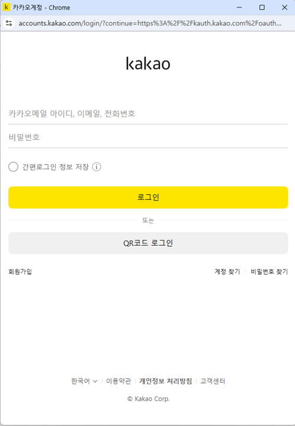
### 2.2 로그아웃
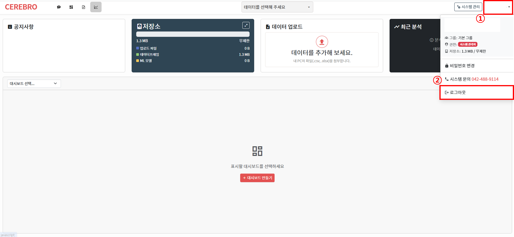

#### ① 개인 프로필 선택
#### ② 로그아웃 버튼 클릭
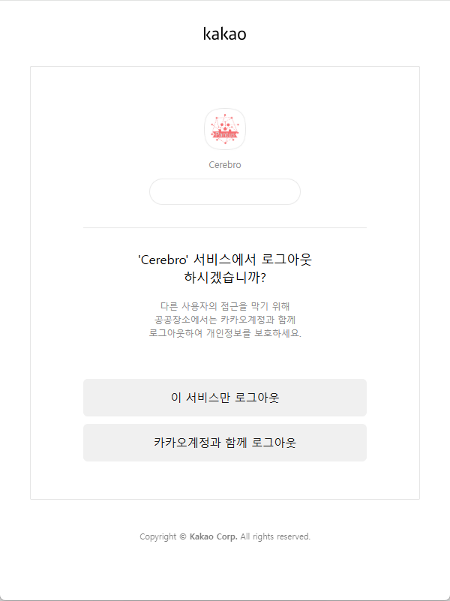
  
  - 카카오 API 를 통한 로그아웃
## 3. 메인화면

#### ① 분석 데이터 선택
- CEREBRO AI 에서 분석에 사용할 데이터를 선택

#### ② 공지사항
- CEREBRO AI 운영 공지사항을 확인
#### ③ 저장소
- 사용자가 올린 분석 데이터 및 모델에 대한 저장량 확인
#### ④ 데이터 업로드
- CEREBRO AI 분석에 사용할 데이터를 업로드
#### ⑤ 최근 분석
- 최근 분석을 수행한 분석 데이터를 확인
#### ⑥ 대시보드 선택
- CEREBRO AI 에서 차트, 연관분석 등 분석에 사용한 대시보드를 로드

## 4. Analyzer

### 4.1 Analyzer 개요
- 사용자가 올린 분석데이터를 기반으로 데이터 전처리, 연관관계 분석, 머신러닝 학습을 수행하는 화면
- 원본데이터와 전처리 데이터의 비교 가능
- 데이터 간 패턴, 관계, 빈도 분석 가능
- 전처리 된 데이터를 기준으로 머신러닝 학습 수행

### 4.2 화면 구성

#### ① 분석 데이터 선택
- CEREBRO AI 에서 분석에 사용할 데이터를 선택

#### ② 공지사항
- CEREBRO AI 운영 공지사항을 확인
#### ③ 저장소
- 사용자가 올린 분석 데이터 및 모델에 대한 저장량 확인
#### ④ 데이터 업로드
- CEREBRO AI 분석에 사용할 데이터를 업로드
#### ⑤ 최근 분석
- 최근 분석을 수행한 분석 데이터를 확인
#### ⑥ 대시보드 선택
- CEREBRO AI 에서 차트, 연관분석 등 분석에 사용한 대시보드를 로드

### 4.3 원본 데이터
- 데이터 선택 시 원본 "데이터 구조" 메뉴로 이동
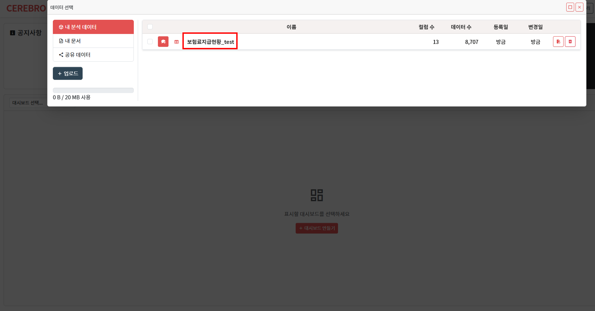
- 선택한 데이터로부터 조회 및 분석을 하기 위함

#### 4.3.1 데이터 구조
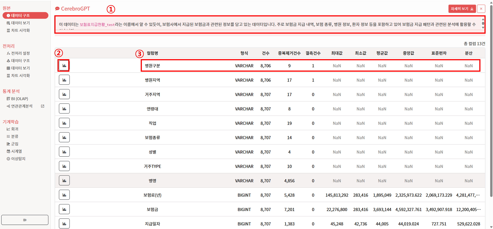

#### ① CerebroGPT 요약
- CEREBRO AI 가 데이터 구조를 이해하여 특징 및 활용방안을 제시
#### ② 컬럼 시각화
- 컬럼의 값에 따른 분포 및 차트를 분석하여 제시
#### ③ 컬럼 정보
- 각 컬럼에 따른 데이터 형식,데이터 건수 등 여러 정보를 한 눈에 조회

#### 4.3.2 데이터 보기
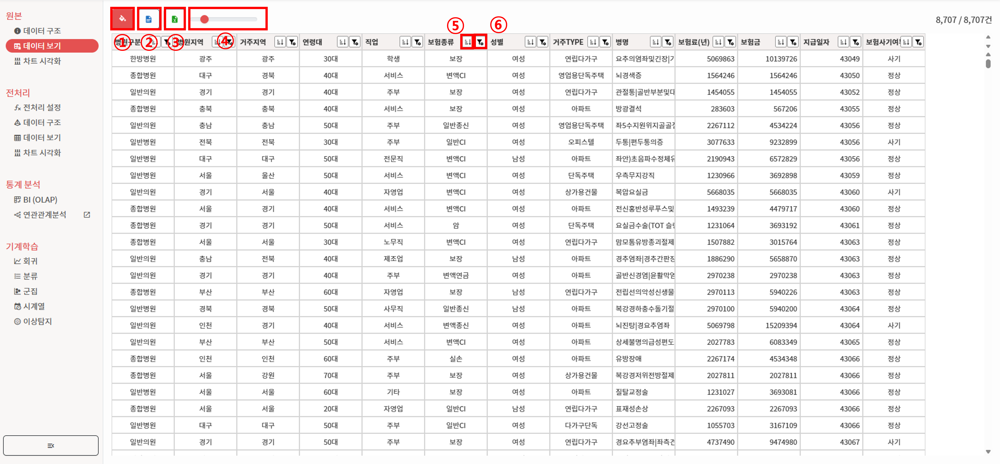

#### ① 그룹 색 적용
- 컬럼별 데이터에 따른 색을 부여하여 화면에 표시
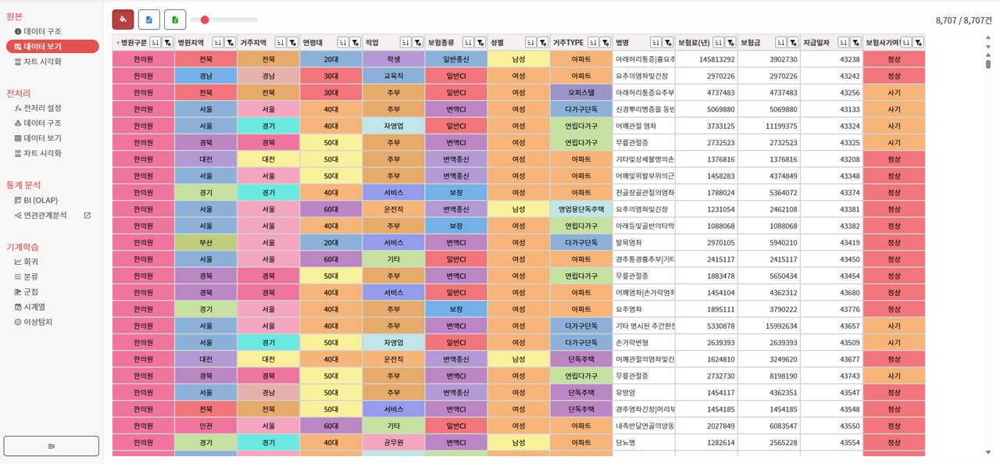

#### ② CSV 다운로드
- 조회한 데이터의 csv파일로 변환하여 다운로드
#### ③ 엑셀 다운로드
- 조회한 데이터의 엑셀파일로 변환하여 다운로드
#### ④ 너비 간격 조절
- 화면에 표시된 표의 너비를 변경
#### ⑤ 해당 컬럼 데이터 정렬
- 해당 컬럼의 데이터를 오름차순 또는 내림차순으로 조회
#### ⑥ 해당 컬럼 데이터 필터
- 해당 컬럼의 데이터를 특정 값 유무를 판단하여 조회  
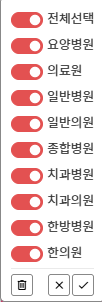

#### 4.3.3 차트 시각화
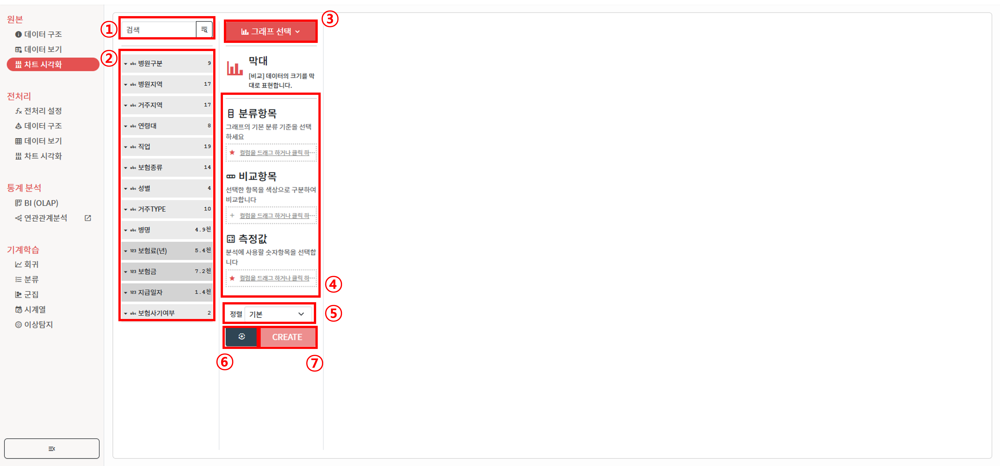

#### ① 컬럼 명 검색
- 컬럼 명을 검색하여 하단에서 조회
#### ② 컬럼 조회
- 조회된 컬럼명과 데이터 수를 조회(기본값은 전체)
#### ③ 차트 선택 버튼
- 시각화할 차트를 조회  
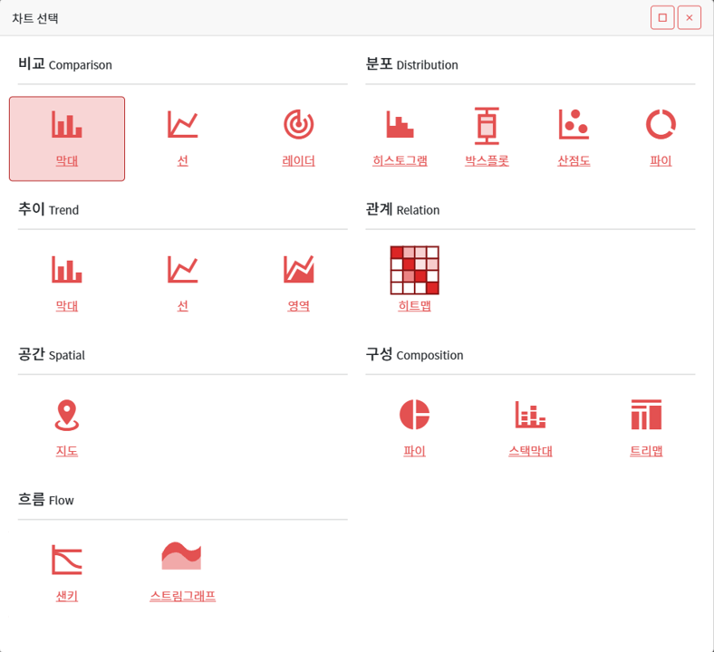

#### ④ 분석 컬럼 항목
- 좌측의 조회된 컬럼을 드래그엔 드랍 및 컬럼 선택으로 조회 가능
  - 드래그엔 드랍  
    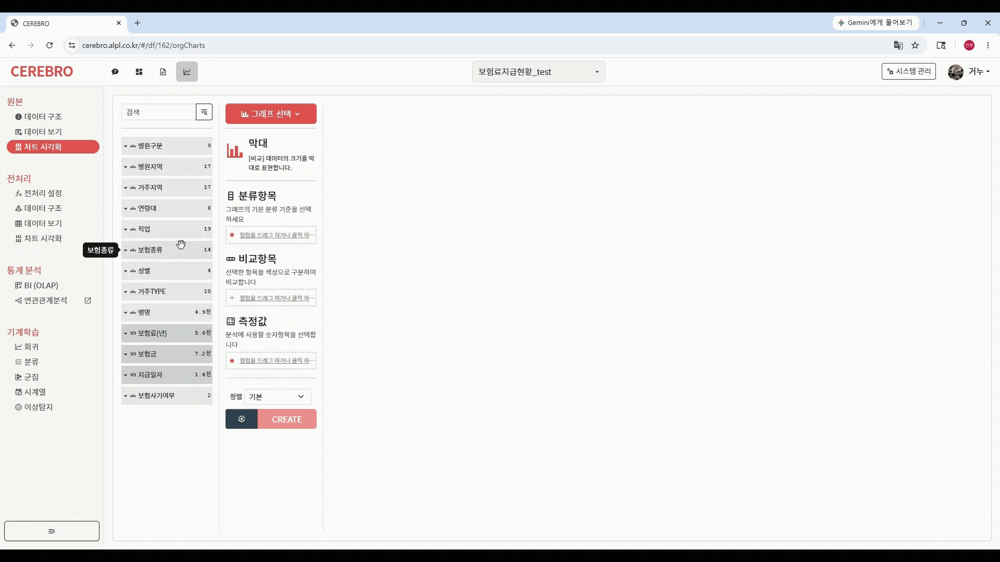

  - 컬럼 선택
    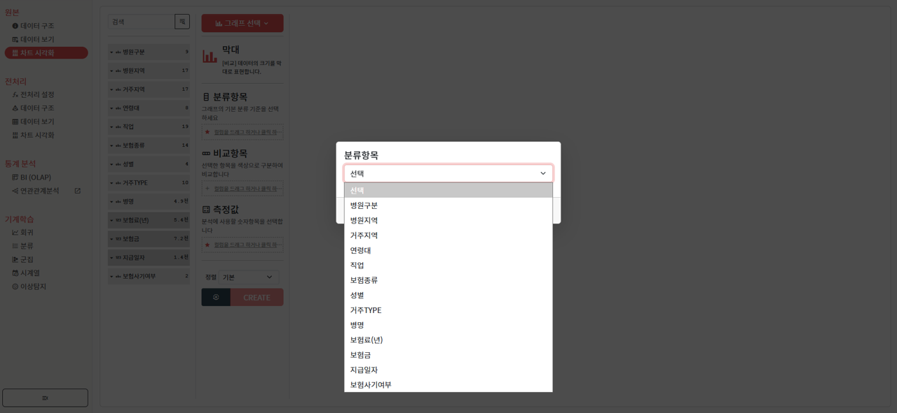

#### ⑤ 차트 정렬
- 분류 항목의 컬럼명 또는 측정값의 데이터의 전체 합계를 기준으로 정렬 
#### ⑥ 자동 실행 버튼
- 차트 생성 버튼을 누르지않고 자동으로 생성
#### ⑦ 차트 생성 버튼
- 화면 우측공간에 차트를 생성

### 4.4 전처리
- 선택한 데이터로부터 전처리 과정을 거친 데이터를 조회 및 분석을 하기 위함
#### 4.4.1 전처리 설정
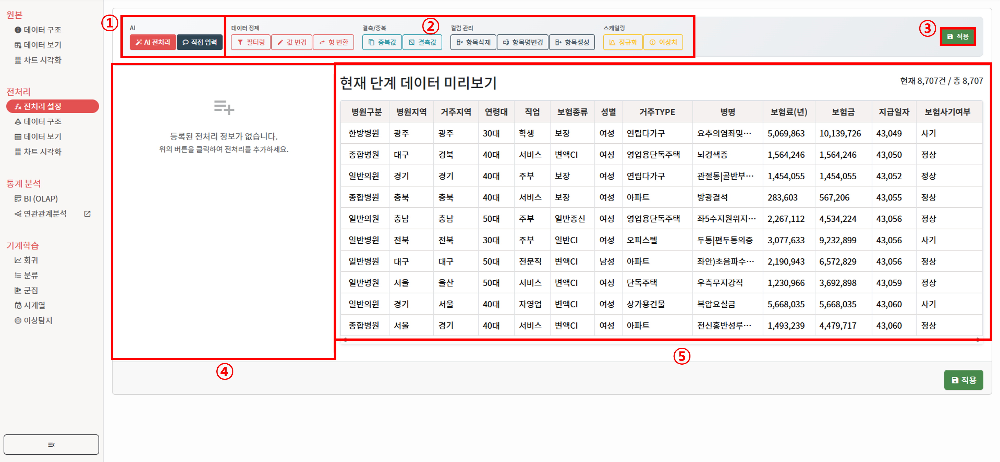

#### ① AI 전처리 
- AI가 현재 단계의 데이터를 분석하여 전처리를 제안하고 전처리 목록을 추가
  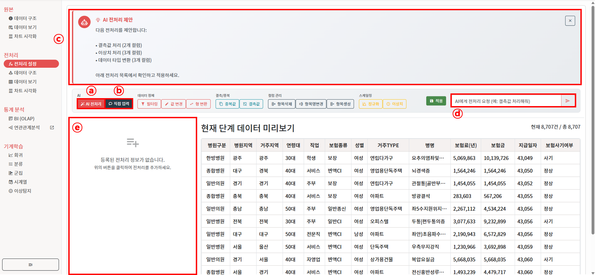
  ##### ⓐ AI 전처리 버튼
  - 버튼을 누르면 AI가 현재 단계 데이터를 분석하여 ⓒ 과 같이 나오며, ⓔ에 전처리 목록을 등록

  ##### ⓑ AI 전처리 요청 창 생성 및 숨기기 버튼
  - 버튼을 누를 시 AI 전처리 직접입력창이 ⓓ와같이 생성

  ##### ⓒ AI 전처리 제안 조회
  - AI가 분석한 전처리 제안 조회

  ##### ⓓ AI 전처리 요청 직접입력창
  - LLM을 통해 요청의 목적을 이해하고 전처리 과정을 진행
  - 요청이 불명확할 시 전처리 함수를 호출하지 않는다.

#### ② 전처리 항목
- 데이터를 전처리할 항목들이 나열되어있다.

|구분|버튼|조건|
|-----|-----|-----|
|데이터정제|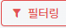|컬럼/조건(포함/시작일치/끝일치/같음/같지않음)/값|
||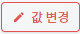|컬럼/대상값/치환값|
||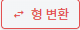|컬럼/처리방법(정수형/부동소수점/문자열/날짜 및 시간/참·거짓/범주)|
|결측/중복|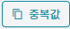|컬럼선택|
||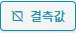|컬럼/처리방법(컬럼삭제/로우삭제/이전행값/다음행값/중앙값/지정값/최빈값/최대값/최소값/평균값/회귀 대체/처리안함)|
|컬럼관리|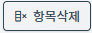|컬럼사용여부|
|||기존 항목명/새 항목명|
||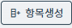|수식/새 컬럼이름|
|스케일링|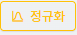|컬럼/처리방법(StandardScaler/MinMaxScaler/MaxAbsScaler/RobustScaler)|
||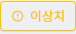|컬럼/방법(IQR(사분위수)/Z-Score)/처리(Clip(자르기)/Drop(삭제)/Mean(평균대체)/Median(중위수대체))/옵션|
  
#### ③ 전처리 정보 적용
  

- ④에 등록된 전처리 정보들을 적용  
- ④에 등록된 미적용 전처리 정보 수 만큼 버튼에 표시가 된다.
#### ④ 전처리 정보 조회
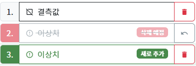 

- 전처리 정보들이 조회되며 미적용 전처리 정보는 위 그림과 같이 "새로 추가" 표시가 되어있다.
- 휴지통 모양 버튼을 누를 시 "새로 추가" 전처리는 삭제되며 이미 적용된 전처리는 "삭제 예정" 상태가 된다. 
- 화살표 모양 버튼을 누를 시 "삭제 예정" 전처리는 다시 적용중인 상태로 변경된다.

#### ⑤ 데이터 미리보기
- 현재 전처리 단계의 데이터를 미리 조회할 수 있다.

#### 4.4.2 데이터 구조
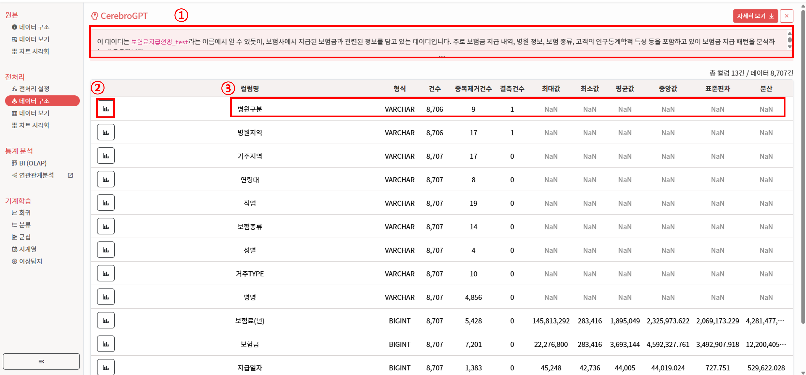

#### ① CerebroGPT 요약
- CEREBRO AI 가 데이터 구조를 이해하여 특징 및 활용방안을 제시
#### ② 컬럼 시각화
- 컬럼의 값에 따른 분포 및 차트를 분석하여 제시
#### ③ 컬럼 정보
- 각 컬럼에 따른 데이터 형식,데이터 건수 등 여러 정보를 한 눈에 조회

#### 4.4.3 데이터 보기
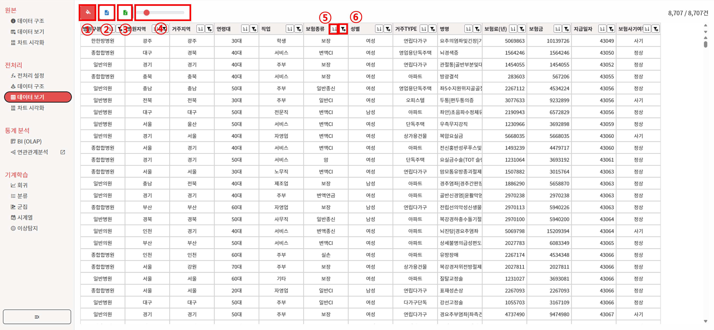

#### ① 그룹 색 적용
- 컬럼별 데이터에 따른 색을 부여하여 화면에 표시
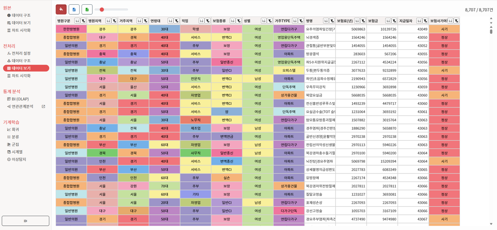

#### ② CSV 다운로드
- 조회한 데이터의 csv파일로 변환하여 다운로드
#### ③ 엑셀 다운로드
- 조회한 데이터의 엑셀파일로 변환하여 다운로드
#### ④ 너비 간격 조절
- 화면에 표시된 표의 너비를 변경
#### ⑤ 해당 컬럼 데이터 정렬
- 해당 컬럼의 데이터를 오름차순 또는 내림차순으로 조회
#### ⑥ 해당 컬럼 데이터 필터
- 해당 컬럼의 데이터를 특정 값 유무를 판단하여 조회  

#### 4.4.4 차트 시각화
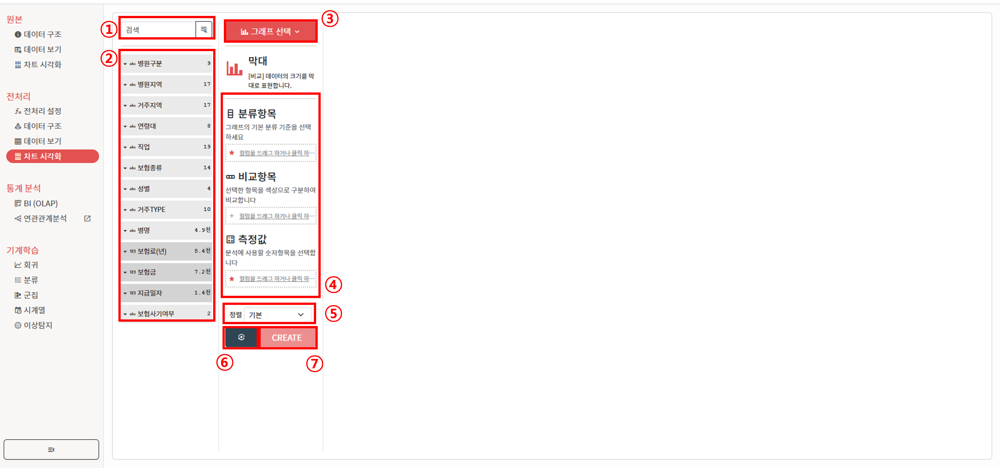

#### ① 컬럼 명 검색
- 컬럼 명을 검색하여 하단에서 조회
#### ② 컬럼 조회
- 조회된 컬럼명과 데이터 수를 조회(기본값은 전체)
#### ③ 차트 선택 버튼
- 시각화할 차트를 조회  

#### ④ 분석 컬럼 항목
- 좌측의 조회된 컬럼을 드래그엔 드랍 및 컬럼 선택으로 조회 가능
  - 드래그엔 드랍  
    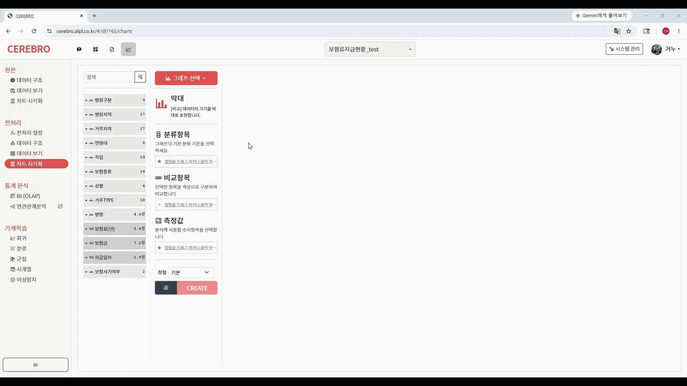

  - 컬럼 선택
    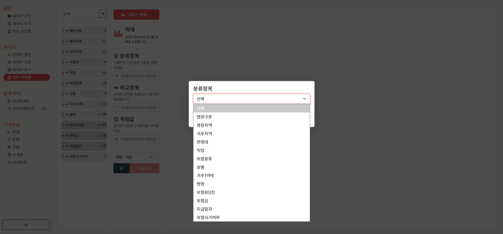

#### ⑤ 차트 정렬
- 분류 항목의 컬럼명 또는 측정값의 데이터의 전체 합계를 기준으로 정렬 
#### ⑥ 자동 실행 버튼
- 차트 생성 버튼을 누르지않고 자동으로 생성
#### ⑦ 차트 생성 버튼

### 4.5 통계분석
|||
|---|---|
|||

- 분석 데이터를 바탕으로 통계 및 속성간 연관관계를 분석하는 시스템

#### 4.5.1 BI(OLAP)

- 분석 데이터를 기반으로 행렬 형태의 통계 자료를 조회하는 화면 

##### ① 분석 항목 선택
- BI 분석에 사용할 항목을 선택

##### ② 분석위젯 및 항목 설정
- 통계자료를 위젯화하여 보기 위한 기능
- 위젯은 최대 5개까지 설정하여 한 화면에서 확인 가능

|버튼|상세|
|---|---|
||선택한 항목의 통계 자료를 표 형태로 조회하는 위젯|
||선택한 항목의 통계자료를 선그래프로 조회하는 위젯|
||선택한 항목의 통계자료를 막대그래프로 조회하는 위젯|
||전체 통계 자료를 표 형태로 조회하는 위젯|
||전체 통계 자료에 필터 조건을 적용하여 조회하는 위젯|

- 또한 항목별 행렬 구성을 기반으로 통계 자료를 산출하여 조회 가능

|버튼|상세|
|---|---|
||PIVOT 그래프에 표시할 단위 설정 (건수, 비율, 건수(비율))|
||선 그래프에서 표시 단위별 축 분리 (건수/비율) |
||선 그래프의 X축과 Y축을 반전하는 기능|
||막대 그래프를 데이터별 적층 형태로 표시하는 기능|
||PIVOT 그래프에서 다수의 측정값을 컬럼별로 분리하여 표시|
||IVOT 그래프에서 1만 단위 이상의 측정값을 간략 표기 (예: 12,000 → 1.2만)|
||다수의 결과 위젯 레이아웃 변경 기능 |

  - Column : 열
  - Row : 행
  - Measure : 통계 기준값(개수, 합계, 평균) 

##### ③ 자료 저장 및 위젯 등록
- 통계 결과를 CSV, XLSX 형식으로 저장하거나 위젯으로 등록
- 위젯은 최대 5개 까지 저장 가능하며, 이는 대시보드에서 확인 가능
##### ④ 저장된 위젯

- 이전에 통계결과를 저장한 위젯 정보를 불러오는 기능
- 저장된 위젯에 대해 불러오기, 수정 및 삭제 기능 제공

##### ⑤ 통계 결과
-  ②에서 설정한 위젯 및 통계 결과를 조회하는 화면

#### 4.5.2 연관관계분석
 

- 분석 데이터를 기반으로 항목 간 연관관계를 분석도로 확인하는 화면

##### ① 분석 항목 선택
- 연관관계 분석에 사용할 항목 선택
- 선택한 항목을 기준으로 항목 간 연관관계 표시

##### ② 연관관계 분석도
- ①에서 선택한 항목에 대한 전체 연관 정보를 노드와 엣지(선) 형태로 표시하는 화
- 필터 조건에 따라 연관 정보를 강조 표시
- 각 항목의 노드를 클릭하여 노드 간 연관관계를 엣지(선)로 확인 가능

##### ③ 저장된 위젯

- 연관관계 분석 결과를 위젯 형태로 저장 및 관리하는 화면
- 저장된 위젯에 대해 불러오기, 수정 및 삭제 기능 제공

##### ④ 분석항목 선택

- 업로드한 데이터에서 연관관계 분석에 사용할 항목을 선택하는 화면
- 지정한 분석 항목을 기준으로 ①의 선택 항목이 구성됨

##### ⑤ 필터

- 연관관계 분석에서 분석 조건, 관계 및 레이아웃 등을 설정하는 기능
- 데이터 간 빈도, 패턴 및 관계를 분석 가능

|필터|상세|
|---|---|
||항목별 검색 조건에 맞는 노드만 표시  예) 병원지역이 광주인 지역에 대한 노드를 필터링할 때 사용|
||분석도 레이아웃 변경 (신경망형, 가로형, 세로형)|
||분석도 노드 간 설정 기능   노드 간 간격, 글자 크기, 이름 표시 및 엣지(선) 표시 설정  빈도수에 따른 엣지(선)의 색상, 두께 및 투명도 설정|
||선택한 노드 간 관계 표시|
||특정 노드 간 빈도 순위(상위 10위) 표시  예) 경북지역 병원의 연령대가 30대인 사람들에 대한 노드 분석을 할 때 사용 |
||각 기준별 빈도가 높은 순서대로 표시  → 표시된 항목 중 빈도가 가장 높은 패턴 중심으로 표시|
||연관관계 분석 화면을 전체 화면으로 표시|
||분석도의 초점을 현재 화면 중심으로 재정렬|
||분석한 연관관계 분석도를 위젯으로 저장하는 기능|

### 4.6 기계학습

- 전처리된 데이터를 기반으로 알고리즘 유형별 인공지능 모델을 학습하는 기능  

| 알고리즘 유형 | 설명 |
|---|---|
| | 연속형 숫자 값을 예측하는 머신러닝 방식 |
|  | 데이터를 특정 범주(Class)로 분류하는 머신러닝 방식 |
|  | 유사한 데이터끼리 자동으로 그룹화하는 비지도 학습 방식 |
|  | 시간 흐름에 따른 패턴을 학습하여 미래 값을 예측하는 방식 |
|  | 일반적인 패턴에서 벗어난 비정상 데이터를 찾아내는 방식 |

#### ① Cerebro GPT
- 알고리즘별 특성과 항목 선정 방법에 대한 도움말을 제공하는 기능

#### ② 모델 학습
- 모델 학습을 위한 항목을 선택하는 기능
- 예측 항목과 영향 요인을 선택하여 학습 항목 지정
   예) 보험사기여부에 관하여 병원구분, 병원지역, 거주지역, 성별이 영향을 준다고 가정하고 모델학습 수행 
- 샘플 데이터를 기반으로 예측 항목 및 영향 요인 자동 추천 기능 제공
- 학습 완료 후 알고리즘별 모델 튜닝 및 재학습 기능 제공

#### ③ 자동 전처리 설정
- 학습 데이터 내 결측치를 자동으로 대처하도록 설정하는 기능 

| 전처리설정 | 설명 |
|---|---|
|결측값 대치 방식|simple(평균·중앙값·최빈값처럼 단순 통계값으로 결측값을 채우는 방식) Iterative(다른 변수들과의 관계를 학습하여 예측값으로 반복적으로 결측값을 채우는 방식)|
숫자형|drop(결측치가 포함된 컬럼 제거) mean(평균값으로 대체) median(중앙값으로 대체) mode(최빈값으로 대체) str(문자열 형태의 특정 값으로 대체)|
|범주형|mode(가장 많이 등장한 값(최빈값)) drop(결측치가 있는 컬럼을 제거) str(문자열형태의 특정값으로 대체)|

#### ④ 학습 알고리즘 선정
- 모델 학습에 사용할 알고리즘 선택
- 학습한 모델 저장 및 튜닝 가능

##### 1. 항목 내역

| 항목 | 설명 |
|---|---|
| 알고리즘 | 모델 학습 시 사용할 알고리즘 유형  (하단 알고리즘 참고) |
| R2 | 모델의 데이터 설명력을 나타내는 적합도 지표 |
| RMSE | 예측값과 실제값의 차이를 기반으로 계산한 오차 지표 |
| RMSLE | 실제값과 예측값의 로그 차이를 기반으로 계산한 오차 지표 |
| MAPE | 실제값 대비 예측 오차의 평균 비율(%)을 나타내는 지표 |
| Accuracy | 전체 데이터 중 정확하게 분류한 비율 |
| AUC | ROC 곡선 아래 면적으로 모델의 분류 성능을 평가하는 지표 |
| Recall | 실제 양성 데이터 중 올바르게 예측한 비율 |
| Prec. | 양성으로 예측한 데이터 중 실제 양성 비율 |
| F1 | Precision과 Recall의 조화 평균으로 계산한 성능 지표 |
| Kappa | 실제값과 예측값 간 일치도를 우연성을 제외하고 평가하는 지표 |
| MCC | 정분류와 오분류를 모두 고려한 이진 분류 성능 지표 |

##### 2. 알고리즘

| 구분 | 알고리즘 | 설명 |
|---|---|---|
| 회귀 | Linear Regression | 변수 간 선형 관계를 기반으로 연속형 값을 예측하는 회귀 알고리즘 |
| 회귀 | Decision Tree Regressor | 데이터 분할 규칙을 기반으로 값을 예측하는 트리 기반 회귀 알고리즘 |
| 회귀 | Lasso Regression | 불필요한 변수의 가중치를 제거하여 과적합을 방지하는 회귀 알고리즘 |
| 회귀 | Ridge Regression | 변수 가중치를 감소시켜 모델의 일반화 성능을 높이는 회귀 알고리즘 |
| 회귀 | K Neighbors Regressor | 주변의 유사한 데이터 값을 기반으로 결과를 예측하는 회귀 알고리즘 |
| 회귀 | Random Forest Regressor | 여러 개의 의사결정트리를 결합하여 예측 정확도를 높인 회귀 알고리즘 |
| 분류 | K Neighbors Classifier | 가까운 데이터의 다수 클래스를 기준으로 분류하는 알고리즘 |
| 분류 | Light Gradient Boosting Machine | 부스팅 기반으로 빠른 속도와 높은 성능을 제공하는 분류 알고리즘 |
| 분류 | Decision Tree Classifier | 데이터 조건 분기를 통해 클래스를 분류하는 트리 기반 알고리즘 |
| 분류 | CatBoost Classifier | 범주형 데이터 처리에 강점을 가진 부스팅 기반 분류 알고리즘 |
| 분류 | Random Forest Classifier | 여러 개의 트리를 결합하여 안정적으로 클래스를 분류하는 알고리즘 |
| 분류 | Extreme Gradient Boosting | 경사하강 기반 부스팅으로 높은 예측 성능을 제공하는 분류 알고리즘 |
| 분류 | Extra Trees Classifier | 무작위 분할을 활용하여 과적합을 줄인 트리 기반 분류 알고리즘 |
| 분류 | Logistic Regression | 확률 기반으로 데이터를 특정 클래스로 분류하는 알고리즘 |
| 분류 | Multi-layer Perceptron | 인공신경망 구조를 기반으로 학습하는 딥러닝 분류 알고리즘 |
| 분류 | Quadratic Discriminant Analysis | 클래스별 분포를 기반으로 데이터를 분류하는 통계 기반 알고리즘 |
| 군집 | K-means Clustering | 유사한 데이터끼리 K개의 군집으로 그룹화하는 군집 알고리즘 |
| 군집 | Density-Based Spatial Clustering | 밀도가 높은 영역을 기준으로 군집을 형성하는 알고리즘 |
| 시계열 | Naive Forecaster | 이전 시점 값을 그대로 사용하여 미래 값을 예측하는 시계열 알고리즘 |
| 시계열 | Seasonal Naive | 계절성을 기반으로 이전 패턴을 반복하여 예측하는 시계열 알고리즘 |
| 시계열 | Polynomial Trend | 다항식 추세를 기반으로 시계열 흐름을 예측하는 알고리즘 |
| 시계열 | Exponential Smoothing (ETS) | 추세와 계절성을 반영하여 데이터를 평활화하는 시계열 알고리즘 |
| 시계열 | Theta Forecaster | 장기 추세를 분해하여 예측 성능을 향상시키는 시계열 알고리즘 |
| 이상탐지 | K-Nearest Neighbors Detector | 주변 데이터와의 거리 차이를 기반으로 이상치를 탐지하는 알고리즘 |
| 이상탐지 | Isolation Forest | 데이터를 무작위로 분리하여 이상치를 탐지하는 트리 기반 알고리즘 |

#### ⑤ 학습 데이터 설정 

||||
|---|---|---|
||||

- 모델 학습 전 학습비율, 이상치 등을 설정하고 모델 학습을 수행하는 기능

| 기능 | 설명 |
|---|---|
| 난수 | 데이터 분할 및 모델 학습 시 동일한 결과 재현을 위한 랜덤 시드 값 |
| 비율 | 학습 데이터와 검증 데이터로 분할할 비율 설정 |
| 군집 개수 | 데이터를 분류할 군집(Cluster) 개수 설정 값 |
| 이상치 비율 | 전체 데이터 중 이상치로 판단할 비율 설정 |

#### 4.6.1 저장된 모델 확인

- 사용자가 학습 후 저장한 모델 정보를 확인하는 화면
- 저장된 모델에 대한 성능 튜닝 및 다운로드 기능 제공

#### 4.6.2 모델 튜닝

|||
|---|---|
||
|||

- 저장된 모델의 예측, 학습 결과 및 다운로드를 수행하는 화면
- 파라미터를 재설정하여 재학습 수행 가능

|파라메터|설명|
|---|---|
|n_neighbors|분류 시 참조할 최근접 이웃의 개수|
|weights|이웃 데이터 반영 가중치 설정|
|algorithm|최근접 이웃 계산 방식 설정|
|leaf_size|BallTree 또는 KDTree 사용 시 리프 크기 설정|
|p|Minkowski 거리 계산에 사용할 거리 기준|
|metric|거리 측정 방식 'minkowski': 거리를 계산할 때 사용되는 일반화된 형태. p 매개변수에 따라 다른 거리 측정 방식을 나타냄. 'manhattan': 격자 모양의 경로를 따라 계산하는 거리. 직선이 아닌 수평, 수직 이동만 고려. 'euclidean': 전통적인 직선 거리. 두 점 의 가장 짧은 직선 경로. 'chebyshev': 체스보드에서 킹이 이동할 수 있는 최소 이동 횟수로 거리를 측정.|

#### 4.6.3 모델 예측

|||
|---|---|
||

- 샘플 데이터를 입력하여 저장된 모델의 예측 결과를 확인하는 화면
- 예측에 필요한 변수 정보를 입력하여 모델 예측 결과를 비교 가능

---

## 5. GPT

<image src="./5_GPT/GPT 메인화면.png" >

- 사용자가 업로드한 자료를 기반으로 GPT를 활용한 데이터 분석 기능 제공 
- 데이터 변화 추이 및 전체 트렌드 분석 기능 지원 
- 최근 대화 이력을 아카이빙하여 관리 
- 업로드한 자료에 대한 초기 분석 방향 제공 
- 전체 대화 내 특정 키워드 검색 기능 지원 

### 5.1 화면 구성

<image src="./5_GPT/GPT_화면구성.png" >

| 메뉴 | 설명 |
|---|---|
|<image src ="./5_GPT/GPT 새 대화.png">|새로운 GPT 대화 생성|
|<image src ="./5_GPT/GPT 내 문서.png">|사용자가 업로드한 분석 자료 조회|
|<image src ="./5_GPT/GPT 파일 첨부.png">|신규 분석 자료 업로드|
|<image src ="./5_GPT/GPT 데이터소스.png">|사용자가 업로드한 분석 자료 확인|
|<image src ="./5_GPT/GPT 보내기.png">|작성한 질의를 GPT로 전송|

### 5.2 내 문서

<image src="./5_GPT/GPT 내문서.png">

- 데이터 및 문서 분석 자료를 관리하는 화면 
- 자료별 공유 여부 및 문서 유형 확인 기능 지원 
- 자료사전을 통한 주요 분석 용어 정보 제공
- DBMS별 테이블 생성 및 조회 기능 제공 

| 메뉴 | 설명 |
|---|---|
|<image src ="./5_GPT/내문서_검색.png">|내 문서 자료 검색|
|<image src ="./5_GPT/내문서_문서_분석데이터.png">|문서 유형별 자료 조회|
|<image src ="./5_GPT/내문서_업로드.png">|신규 분석 자료 업로드|
|<image src ="./5_GPT/내문서_문서포함검색.png">|선택한 문서를 포함하여 GPT 질의 수행 가능|
|<image src ="./5_GPT/내문서_자료사전.png">|업무별 주요 용어 정보 제공(컬럼 ID, 컬럼명, 속성 등)|

### 5.3 자료 사전

<image src="./5_GPT/GPT_자료사전.png">
<image src="./5_GPT/GPT_자료사전2.png">

- 업무에서 사용하는 데이터 컬럼 정보를 사전 형태로 제공하는 화면 
- 업무 관련 테이블 조합 및 쿼리 작성 보조 기능 제공 

---
## 6. Dashboard
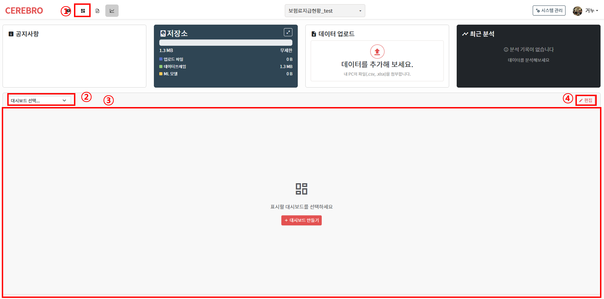

#### ① 대시보드 바로가기 버튼
#### ② 대시보드 불러오기 
#### ③ 대시보드 조회(없으면 대시보드 생성)
#### ④ 대시보드 편집(없으면 대시보드 생성)

### 6.1 Dashboard 개요
- 사용자가 보유한 데이터를 목적에 의해 설정하고, 한눈에 알아볼 수 있도록 수치 및 그래프 , 분포도, 평균, 총 데이터 합, 최소, 최대 등 필요한 정보를 알 수 있도록 화면을 구성

### 6.2 대시보드
- 6. 에서 구성된 버튼으로 대시보드 생성화면 이동
  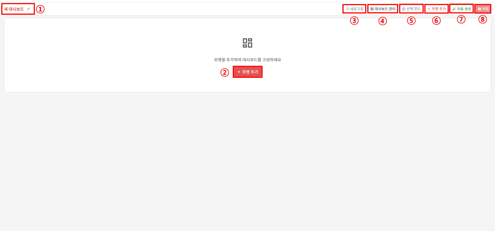

  #### ① 대시보드 명
    - 클릭 시 대시보드 명을 수정할 수 있다.
  #### ② 위젯 추가 버튼
    - 대시보드를 구성하는 위젯을 추가(6.3에서 상세)
  #### ③ 새로고침 버튼
    - 새로고침하여 로드 시 모습을 확인 가능하다.
  #### ④ 대시보드 관리 버튼
    - 대시보드를 CRUD 및 기본설정이 가능하다.
  #### ⑤ 선택모드 버튼
    - 위젯들을 일괄 및 선택 삭제가 가능하다.
  #### ⑥ 위젯추가 버튼
    - ②와 동일, 대시보드를 구성하는 위젯을 추가
  #### ⑦ 자동생성 버튼
    - 선택한 데이터를 AI가 분석하여 대시보드 공간에 맞게 위젯을 자동으로 생성
  #### ⑧ 저장 버튼
    - 생성한 대시보드를 저장

### 6.3 위젯 추가
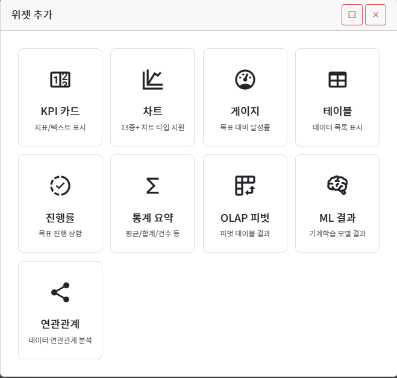
 
  |기준명|목적|
  |-----|-----|
  |KPI|핵심성과지표/수치를 한눈에 보여주는 요약박스|
  |차트|다양한 차트유형으로 데이터를 보기쉽게, 파악하기 쉽게 조회가능|
  |게이지|데이터의 합계,평균,최대,최소에 따른 목표치% 조회가능|
  |테이블|테이블 형식의 데이터를 직관적으로 조회 가능|
  |진행률|데이터의 합계,평균,최대,최소에 따른 목표치 달성률 조회가능|
  |통계요약|건수,합계,평균,최소,최대,중앙값,표준편차에 따른 데이터 통계요약을 한 눈에 조회가능|
  |OLAP 피벗|고속 다차원 데이터 분석 기술/""작성불가""|
  |ML 결과|""작성불가""|
  |연관관계|""작성불가""|

### 6.4 대시보드 관리
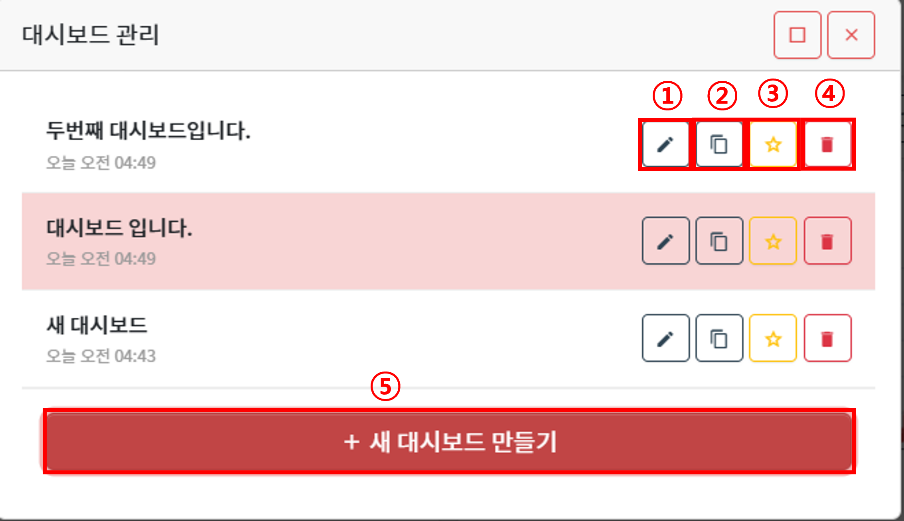

  #### ① 대시보드 이름변경 벼튼
  - 클릭 시 대시보드 명을 수정할 수 있다.
  #### ② 대시보드 복제 버튼
  - 해당 대시보드를 복제하여 생성한다.
  #### ③ 기본으로 설정 버튼
  - 메인화면에 쓰일 대시보드를 선정한다.
  #### ④ 대시보드 삭제 버튼
  - 해당 대시보드 삭제한다.
  #### ⑤ 대시보드 생성 버튼
  - 새 대시보드를 작성하는 화면으로 이동한다.

### 6.5 자동 생성 기능
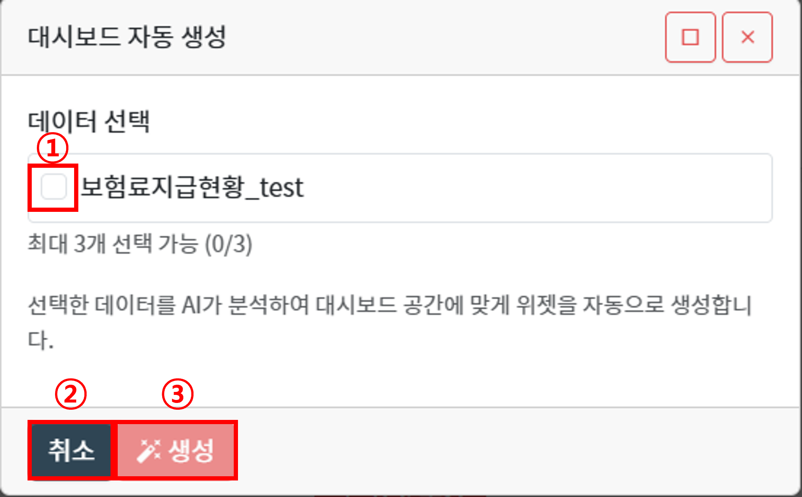

  #### ① 보유한 데이터 선택 체크박스
  - 위젯으로 쓰일 데이터를 선택
  #### ② 대시보드 자동생성 취소 버튼
  - 해당 대시보드를 복제하여 생성한다.
  #### ③ 대시보드 자동생성
  - 체크박스를 체크했다면 AI가 분석하여 대시보드 공간에 맞게 위젯을 자동으로 생성

---

## 7. Report

|||
|---|---|
|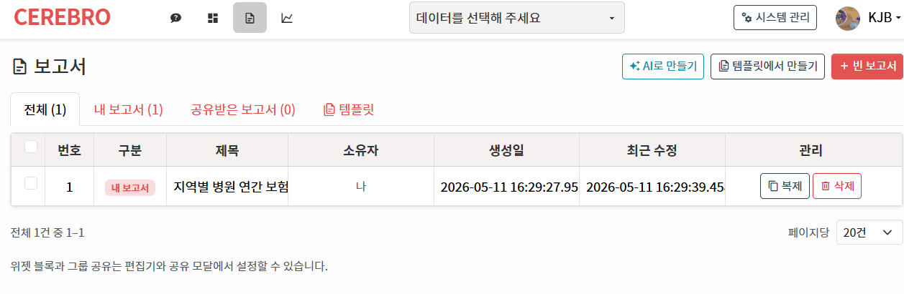|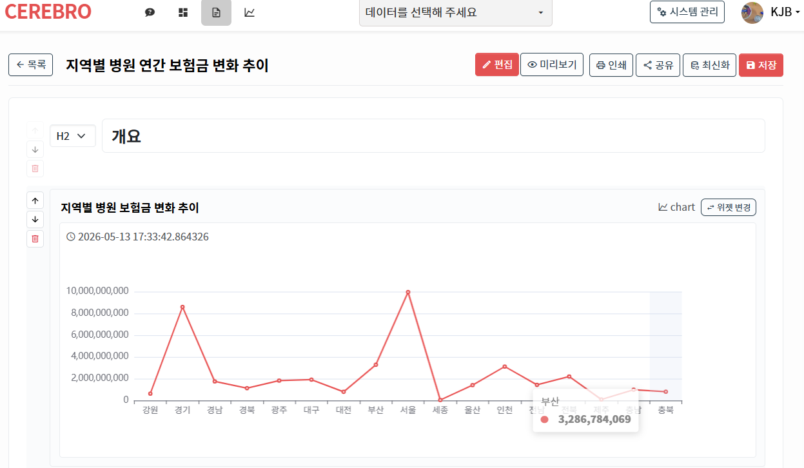

- 업로드 된 데이터를 기반으로 보고서를 작성하는 기능
- 블록 형식으로 보고서를 작성
- 보고서에 대시보드 및 위젯 추가 가능
- AI를 통해 보고서 및 블록 추가 가능
- 데이터 최신화를 통해 데이터 갱신 가능
- 팀원간 보고서 공유를 통해 작성 가능

### 7.1 화면 구성

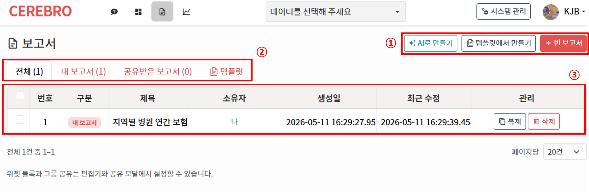

#### ① 보고서 생성
- 신규 보고서를 생성

|종류|상세|
|---|---|
||AI를 통하여 단계별로 보고서를 작성|
||사용자가 만든 템플릿으로 보고서를 작성|
||빈 보고서 작성|

#### ② 보고서 목록
- 계정에서 사용가능한 보고서 목록

|기능|상세|
|---|---|
|내 보고서|개인이 작성하는 보고서|
|공유받은 보고서|계정끼리 공유하는 보고서|
|템플릿|보고서 작성을 위해 정한 양식|

### 7.2 템플릿

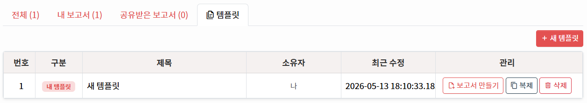

- 보고서 작성시 사용되는 기본 양식을 정의한 것
- 새 템플릿 버튼을 눌러 작성하고, 보고서 만들기를 통해 해당양식으로 보고서 작성

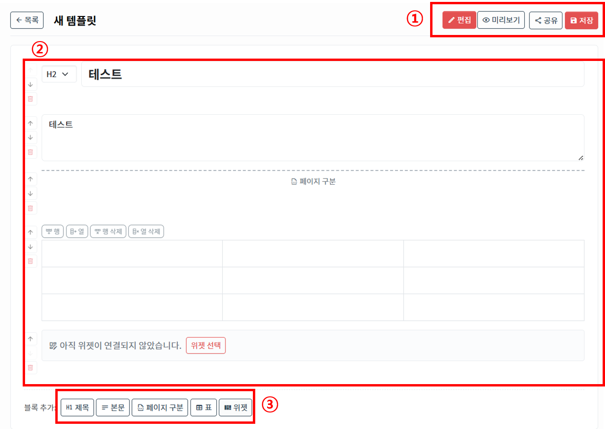

#### ① 템플릿 편집
- 템플릿 편집/미리보기/공유/저장 기능

|종류|상세|
|---|---|
|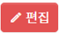|템플릿 편집화면으로 전환|
||템플릿 미리보기화면으로 전환|
|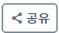|작성한 템플릿을 공유|
||작성한 템플릿을 저장|

##### 7.2.1 템플릿 미리보기

- 작성한 템플릿을 미리보기를 통해 최종 인쇄화면을 확인

#### ② 템플릿 본 블럭

- 블록을 추가하여 작성하는 템플릿 블럭

#### ③ 항목 추가

- 보고서 템플릿을 구성하는 주요 위젯(미리보기 참고)

|종류|상세|
|---|---|
|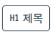|보고서에 들어갈 타이틀 제목|
|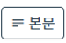|보고서에 들어갈 몬문 내역|
||보고서 페이지 구분선|
|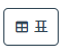|사용자 데이터 기반 보고서 표 작성|
|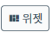|사용자가 분석에 사용한 대시보드나 위젯 사용|

### 7.3 보고서 작성

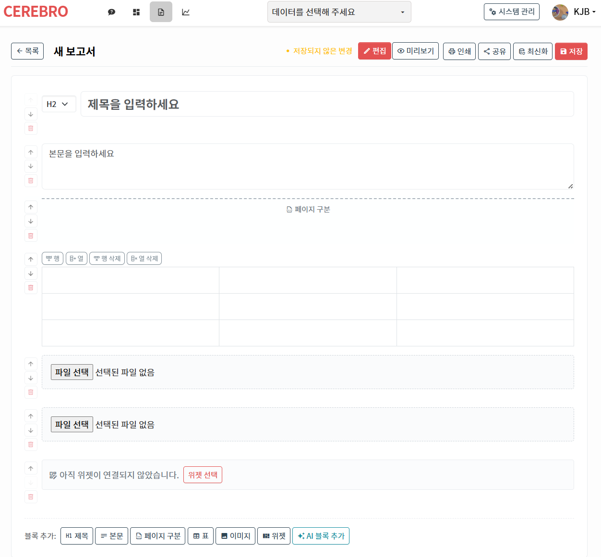

- 새로운 보고서를 작성하는 기능
- 기존 템플릿을 불러와 신규 보고서 형식으로 작성가능
- 내부 데이터가 갱신되었을 떄 최신화를 통하여 데이터 갱신 가능
- 미리보기를 통하여 확인한 후 보고서를 인쇄

|종류|상세|
|---|---|
|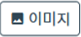|보고서에 이미지 삽입|
||보고서 내용을 기반으로 요약 내용을 AI가 자동 생성|
||보고서 인쇄|
|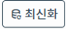|사용된 위젯 및 대시보드의 데이터를 최신화|

#### 7.3.1 AI로 보고서 만들기

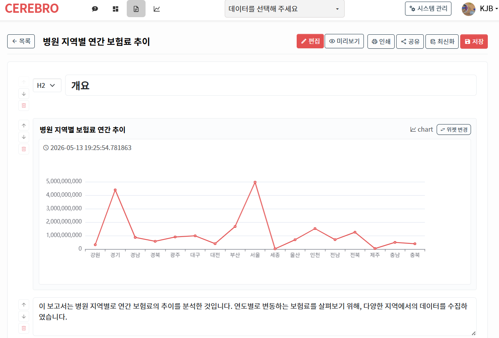

- 업로드한 데이터와 주제를 선정하여 자동으로 AI가 보고서를 생성하는 기능
- 위젯과 본문을 한번에 생성

##### 7.3.1.1 보고서 주제 선정

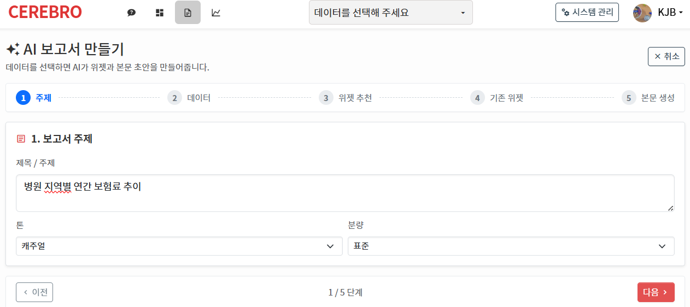

- 보고서 작성을 위한 주제를 선정하는 기능
- 업로드 된 데이터와 어느정도의 주제가 일치해야 함.
- 보고서 작성 톤과 분량을 지정

##### 7.3.1.2 데이터셋 선택

- 작성할 보고서의 주요 데이터셋 지정
- 업로드 된 데이터를 기반으로 작성

##### 7.3.1.3 위젯추가

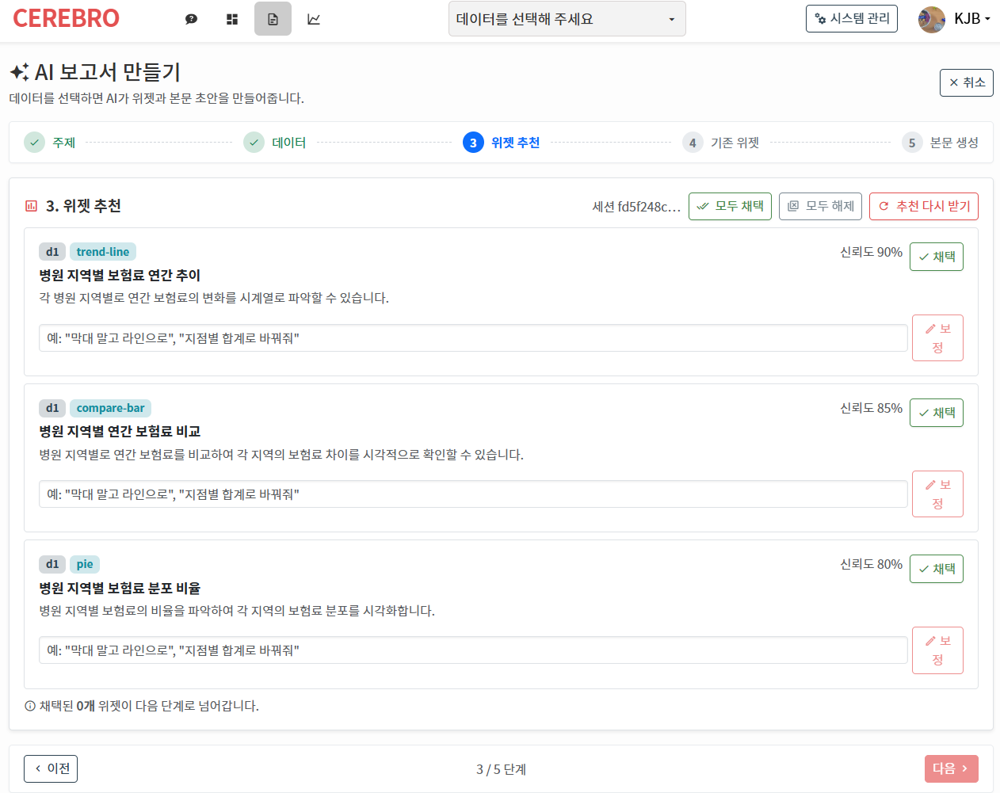

- 작성한 주제와 선택한 데이터를 기반으로 AI가 분석하여 자동으로 위젯을 생성
- 주제와 관련이 높은 신뢰도를 바탕으로 정렬하며 채택을 통해 본문 보고서에 추가
- 추천 다시 받기를 통하여 재생성 하며, 3개씩 AI가 생성

##### 7.3.1.4 기존 대시보드 위젯 추가

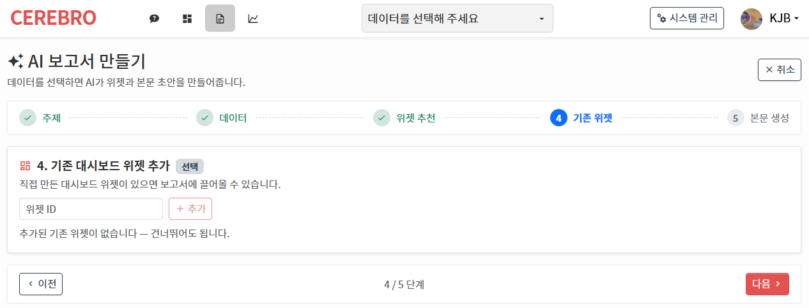

- 기존에 작성된 대시보드나 위젯을 선정하여 본문에 추가하는 기능
- 없을 경우 스킵가능

##### 7.3.1.5 본문생성

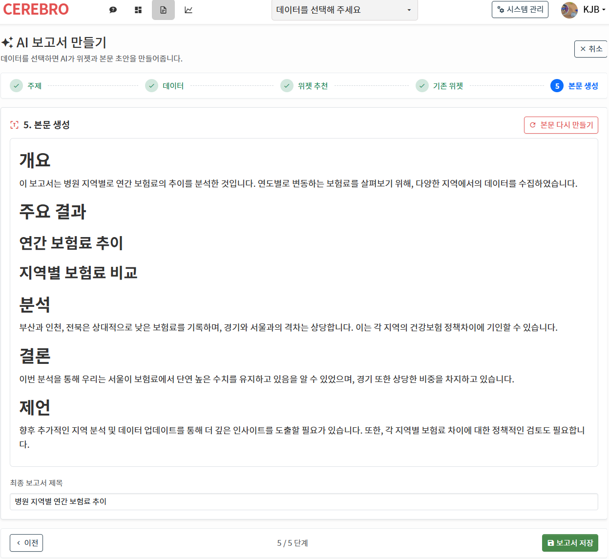

- 작성된 주제와 선택한 데이터를 바탕으로 보고서 본문 작성
- 보고서 저장을 통해 생성되며, 최신화를 통해 위젯 활성화

