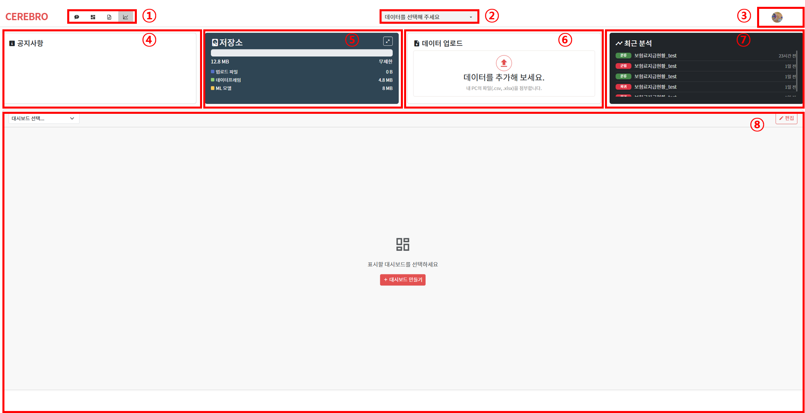

# CEREBRO 사이트 사용자 설명서
## 1. CEREBRO AI
### 1.1 CEREBRO AI란
- 
-

### 1.2 CEREBRO AI 특징
-
-
## 2. 로그인

### 2.1 로그인
-
-

### 2.2 로그아웃
-
-
-

## 3. 메인화면

-
-

### 3.1 화면 구성

#### ① 분석 데이터 선택
- CEREBRO AI 에서 분석에 사용할 데이터를 선택

#### ② 공지사항
- CEREBRO AI 운영 공지사항을 확인
#### ③ 저장소
- 사용자가 올린 분석 데이터 및 모델에 대한 저장량 확인
#### ④ 데이터 업로드
- CEREBRO AI 분석에 사용할 데이터를 업로드
#### ⑤ 최근 분석
- 최근 분석을 수행한 분석 데이터를 확인
#### ⑥ 대시보드 선택
- CEREBRO AI 에서 차트, 연관분석 등 분석에 사용한 대시보드를 로드

### 3.2 메인화면 기능

## 4. Analyzer

### 4.1 Analyzer 개요
- 사용자가 올린 분석데이터를 기반으로 데이터 전처리, 연관관계 분석, 머신러닝 학습을 수행하는 화면
- 원본데이터와 전처리 데이터의 비교 가능
- 데이터 간 패턴, 관계, 빈도 분석 가능
- 전처리 된 데이터를 기준으로 머신러닝 학습 수행

### 4.2 화면 구성
- 상단 메뉴 영역
- 데이터 선택 영역
- 좌측 분석 메뉴
- 본문 분석 결과 영역
- 상세보기 및 다운로드 기능

### 4.3 데이터 구조 확인
- 선택된 데이터 파일 확인
- 데이터 자동 설명 확인
- 전체 컬럼 수 확인
- 컬럼별 데이터 구조 확인

### 4.4 컬럼 정보 분석
- 컬럼명
- 데이터 형식
- 전체 건수
- 중복 제거 건수
- 결측 건수
- 최대값
- 최소값
- 평균값
- 중앙값
- 표준편차
- 분산

### 4.5 원본 데이터 분석
- 원본 데이터 구조 확인
- 원본 데이터 보기
- 원본 데이터 차트 시각화

### 4.6 전처리 데이터 분석
- 전처리 설정
- 전처리 후 데이터 구조 확인
- 전처리 후 데이터 보기
- 전처리 후 차트 시각화

### 4.7 통계 분석
- BI(OLAP) 분석
- 연관관계 분석

### 4.8 기계학습 분석
- 회귀 분석
- 분류 분석
- 군집 분석
- 시계열 분석
- 이상탐지 분석

---

## 4. GPT

<image src="./GPT/GPT 메인화면.png" >

- 사용자가 업로드한 자료를 기반으로 GPT를 활용한 데이터 분석 화면
- 데이터 변화 추이 및 전체 트렌드 분석 지원
- 최근 대화 이력을 아카이빙하여 보관
- 업로드한 자료에 대한 초기 분석 방향 제시
- 전체 대화 내 특정 키워드 검색 기능 제공

| 메뉴 | 설명 |
|---|---|
|<image src ="./GPT/GPT 새 대화.png">|새로운 대화를 생성한다.|
|<image src ="./GPT/GPT 내 문서.png">|사용자가 업로드한 자료를 확인한다.|
|<image src ="./GPT/GPT 파일 첨부.png">|GPT와 대화할 떄 사용할 자료를 첨부한다.|
|<image src ="./GPT/GPT 데이터소스.png">|사용자가 업로드한 자료를 확인한다.|
|<image src ="./GPT/GPT 보내기.png">|작성한 대화를 GPT에게 보낸다.|

### 4.1 내 문서

<image src="./GPT/GPT 내문서.png">

- 데이터 및 문서 분석을 위한 자료 관리 화면
- 자료별 공유 여부 및 문서 종류 확인 지원
- 자료사전을 통한 주요 분석 용어 정보 제공
- DBMS별 테이블 생성 및 조회 기능 지원

| 메뉴 | 설명 |
|---|---|
|<image src ="./GPT/내문서_검색.png">|내 문서 내 자료 검색|
|<image src ="./GPT/내문서_문서_분석데이터.png">|문서 구분별 자료 조회|
|<image src ="./GPT/내문서_업로드.png">|신규 분석 자료 업로드|
|<image src ="./GPT/내문서_문서포함검색.png">|선택한 문서를 포함하여 GPT 질의 수행|
|<image src ="./GPT/내문서_자료사전.png">|업무별 주요 용어 정보 제공(컬럼 ID, 컬럼명, 속성 등)|

### 4.2 자료 사전

<image src="./GPT/GPT_자료사전.png">
<image src="./GPT/GPT_자료사전2.png">

- 업무에서 사용하는 데이터 컬럼 정보를 사전 형태로 제공
- 업무 관련 테이블 조합 및 쿼리 작성 보조 기능 지원

---
## 5. Dashboard

### 5.1 Dashboard 개요
- Dashboard 화면의 목적
- 위젯 기반 대시보드 구성 방식
- 데이터 시각화 화면으로서의 역할

### 5.2 화면 구성
- 대시보드 제목 영역
- 상단 기능 버튼 영역
- 위젯 배치 영역
- 빈 대시보드 안내 영역

### 5.3 대시보드 생성
- 새 대시보드 생성
- 대시보드 이름 수정
- 대시보드 저장

### 5.4 위젯 추가
- 위젯 추가 버튼 사용
- 위C젯을 통한 차트 구성
- 위젯 배치 및 구성 방식

### 5.5 대시보드 관리
- 새로고침
- 대시보드 관리
- 선택 모드
- 저장 기능

### 5.6 자동 생성 기능
- 자동 생성 기능의 목적
- 데이터 기반 대시보드 자동 구성
- 자동 생성 결과 활용

### 5.7 대시보드 활용
- 주요 지표 확인
- 차트 및 시각화 자료 확인
- 분석 결과 모니터링

---

## 6. Report

### 6.1 Report 개요
- Report 화면의 목적
- 분석 결과를 보고서로 정리하는 기능
- 보고서 생성 및 관리 기능

### 6.2 화면 구성
- 데이터 선택 영역
- 보고서 생성 버튼 영역
- 보고서 분류 탭
- 보고서 목록 테이블
- 보고서 관리 영역

### 6.3 보고서 생성 방식
- AI로 만들기
- 템플릿에서 만들기
- 빈 보고서 만들기

### 6.4 보고서 목록 관리
- 전체 보고서
- 내 보고서
- 공유받은 보고서
- 템플릿

### 6.5 보고서 정보 확인
- 번호
- 구분
- 제목
- 소유자
- 생성일
- 최근 수정일
- 관리 항목

### 6.6 보고서 편집
- 보고서 제목 설정
- 분석 내용 입력
- 차트 및 위젯 삽입
- 데이터 요약 내용 삽입

### 6.7 보고서 공유
- 보고서 공유 기능
- 공유받은 보고서 확인
- 협업 및 권한 관리

### 6.8 보고서 활용
- 분석 결과 문서화
- 내부 보고 자료 작성
- 데이터 기반 의사결정 자료 생성