# CEREBRO 사이트 사용자 설명서
## 1. CEREBRO AI
### 1.1 CEREBRO AI란
|||
|---|---|
|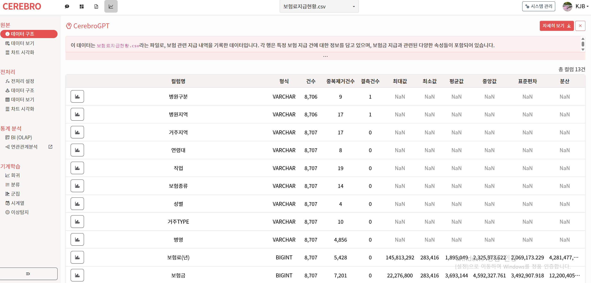|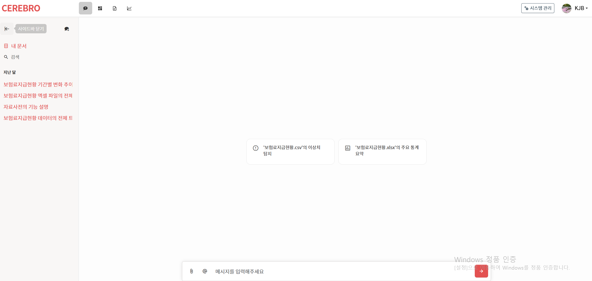|
|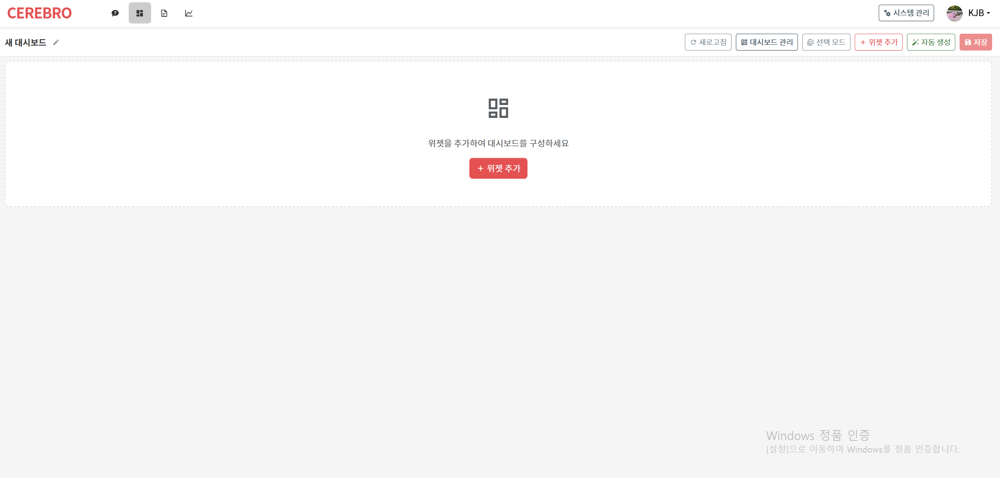|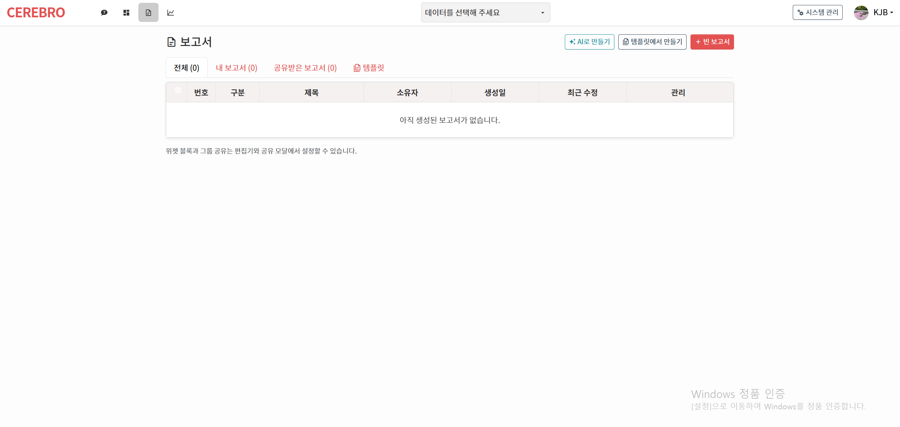|
- 데이터를 가공·분석하고 기계학습 기반 모델을 생성할 수 있는 AI 분석 플랫폼

### 1.2 CEREBRO AI 특징

- 데이터 업로드만으로 전처리, 데이터 분석, 기계학습 수행 가능
- GPT 기반 데이터 분석을 통해 평균값, 이상치 등 주요 데이터 특성 파악 지원
- AI를 활용한 대시보드 자동 생성 및 데이터 흐름 시각화 제공

## 2. 로그인
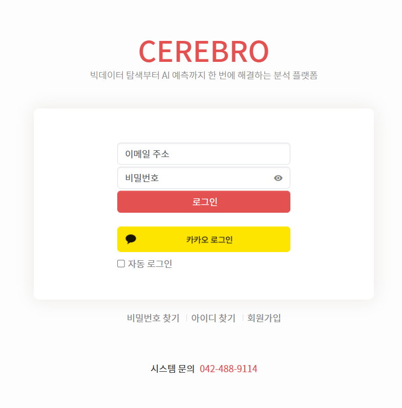

### 2.1 로그인
- 카카오 API 를 사용하여 로그인 화면 구성

### 2.2 로그아웃
-
-
-

## 3. 메인화면

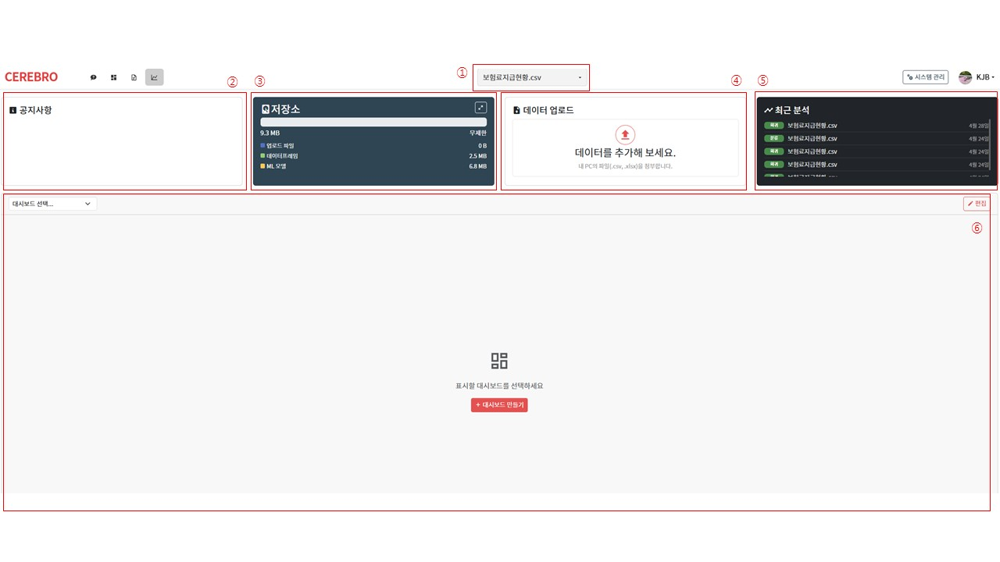

#### ① 분석 데이터 선택
- CEREBRO AI 에서 분석에 사용할 데이터를 선택

#### ② 공지사항
- CEREBRO AI 운영 공지사항을 확인
#### ③ 저장소
- 사용자가 올린 분석 데이터 및 모델에 대한 저장량 확인
#### ④ 데이터 업로드
- CEREBRO AI 분석에 사용할 데이터를 업로드
#### ⑤ 최근 분석
- 최근 분석을 수행한 분석 데이터를 확인
#### ⑥ 대시보드 선택
- CEREBRO AI 에서 차트, 연관분석 등 분석에 사용한 대시보드를 로드

## 4. Analyzer
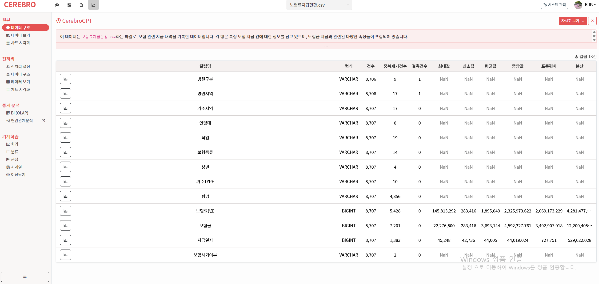

### 4.1 Analyzer 개요
- 사용자가 올린 분석데이터를 기반으로 데이터 전처리, 연관관계 분석, 머신러닝 학습을 수행하는 화면
- 원본데이터와 전처리 데이터의 비교 가능
- 데이터 간 패턴, 관계, 빈도 분석 가능
- 전처리 된 데이터를 기준으로 머신러닝 학습 수행

### 4.2 화면 구성

#### ① 분석 데이터 선택
- CEREBRO AI 에서 분석에 사용할 데이터를 선택

#### ② 공지사항
- CEREBRO AI 운영 공지사항을 확인
#### ③ 저장소
- 사용자가 올린 분석 데이터 및 모델에 대한 저장량 확인
#### ④ 데이터 업로드
- CEREBRO AI 분석에 사용할 데이터를 업로드
#### ⑤ 최근 분석
- 최근 분석을 수행한 분석 데이터를 확인
#### ⑥ 대시보드 선택
- CEREBRO AI 에서 차트, 연관분석 등 분석에 사용한 대시보드를 로드

### 4.3 원본 데이터

#### 4.3.1 데이터 구조
#### 4.3.2 데이터 보기
#### 4.3.3 차트 시각화

### 4.4 전처리

#### 4.4.1 전처리 설정
#### 4.4.2 데이터 구조
#### 4.4.3 데이터 보기
#### 4.4.4 차트 시각화

### 4.5 통계분석
|||
|---|---|
|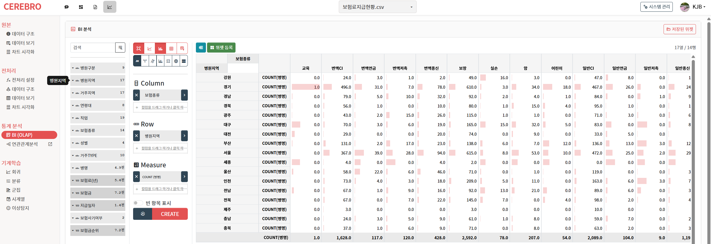|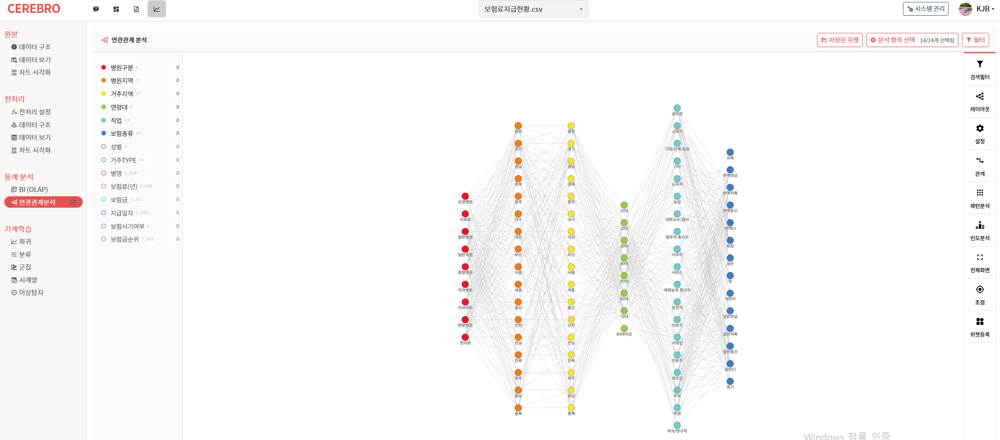|

- 분석 데이터를 바탕으로 통계 및 속성간 연관관계를 분석하는 시스템

#### 4.5.1 BI(OLAP)

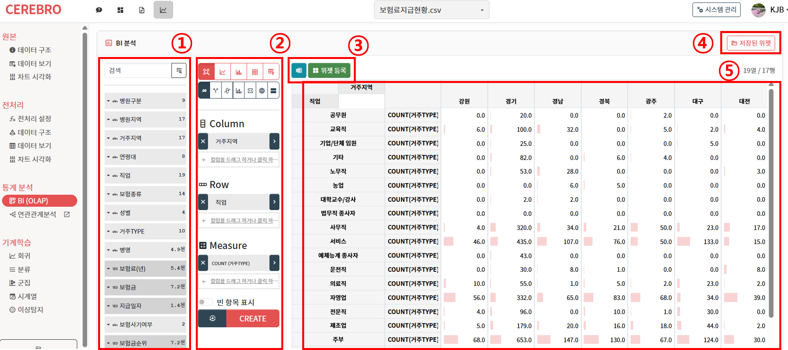

- 분석 데이터를 기반으로 행렬 기준으로 통계화 한 자료를 조회하는 화면

##### ① 분석 항목 선택
- BI 분석에 사용할 항목을 선택

##### ② 분석위젯 및 항목 설정
- 통계자료를 위젯화하여 보기 위한 기능
- 위젯은 최대 5개 까지 설정하여 한 화면에 볼 수 있음

|버튼|상세|
|---|---|
||선택한 항목의 통계자료를 표로 조회하는 위젯|
||선택한 항목의 통계자료를 선그래프로 조회하는 위젯|
|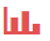|선택한 항목의 통계자료를 막대그래프로 조회하는 위젯|
|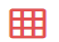|전체 통계 자료를 조회하는 위젯|
||전체 통계자료를 필터 조건을 추가하여 조회하는 위젯|

- 또한 항목별로 행렬화 한 후 이를 기준으로 통계자료를 산출하여 볼 수 있음.

|버튼|상세|
|---|---|
|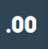|PIVOT그래프에서 표기할 단위 설정(건수,비율,건수(비율))|
||선그래프에서 표기 단위별로 축을 분리(건수/비율) |
||선그래프의 X,Y축 반전|
||막대그래프에서 데이터 별 적층형 그래프로 표기|
||PIVOT그래프에서 다수의 측정값이 있을 경우 컬럼으로 분리|
||PIVOT그래프에서 1만단위 이상 측정값에 대한 표기 간략화 (예, 12,000 -> 1.2만)|
||다수의 결과 위젯 레이아웃 변경 |

  - Column : 열
  - Row : 행
  - Measure : 통계 방법(개수, 합계, 평균)

##### ③ 자료 저장 및 위젯 등록
- 통계 결과에 대하여 자료저장(csv, xlsx) 및 위젯화 하여 등록
- 위젯은 최대 5개 까지 저장 가능하며, 이는 대시보드에서 확인 가능
##### ④ 저장된 위젯

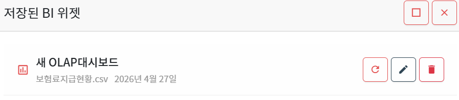

- 이전에 통계결과를 저장한 위젯 정보를 불러오는 기능
- 저장한 위젯에 대하여 불러오기, 수정, 삭제 기능

##### ⑤ 통계 결과
-  ② 에서 지정한 위젯 및 통계결과를 조회하는 화면

#### 4.5.2 연관관계분석
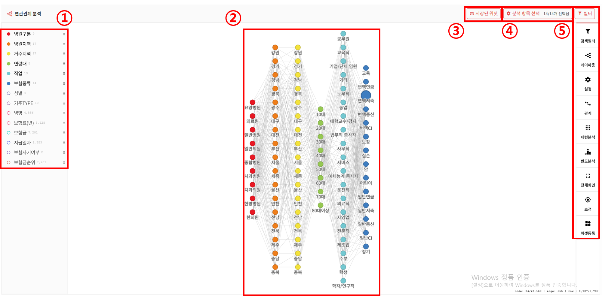 

- 분석 데이터 간 연관관계를 분석도를 통해 확인하는 화면

##### ① 분석 항목 선택
- BI 분석에 사용할 항목을 선택
- 선택된 항목에 따라 항목간 연관관계가 표기됨.

##### ② 연관관계 분석도
- ① 에서 선택된 항목에 대한 전체 항목에 대한 모든 연관 정보를 노드로 모두 연결한 화면
- 필터 조건에 따라 연관정보를 강조하여 표기
- 각 항목별 노드를 클릭시 노드별 연관관계를 엣지(선)을 통하여 확인

##### ③ 저장된 위젯

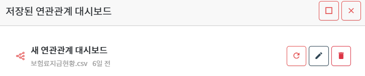

- 연관관계분석 결과에 대한 정보를 위젯화 하여 관리하는 화면
- 저장한 위젯에 대하여 불러오기, 수정, 삭제 기능
##### ④ 분석항목 선택

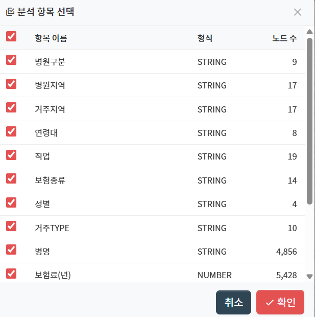

- 업로드한 데이터에서 연관관계 분석에 쓸 항목을 선택하는 화면
- 분석항목 지정을 기준으로 ① 의 선택 항목이 지정됨.

##### ⑤ 필터

- 연관관계 분석에서 분석/관계/레이아웃 등 필터링하기 위한 기능
- 해당 기능을 통하여 빈도, 패턴, 관계를 파악 가능

|필터|상세|
|---|---|
|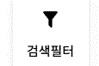|항목별로 검색조건에 맞는 노드만을 표기  예) 병원지역이 광주인 지역에 대한 노드를 필터링할 때 사용|
|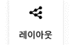|분석도의 레이아웃 변경(신경망, 가로, 세로)|
|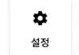|분석도 노드간 설정   노드간 간격, 글씨크기, 이름표기, 엣지(선)표기,  빈도수에 따른 엣지 선 색상,두께 투명도 설정|
|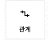|선택한 노드별 관계를 표기|
||특정노드간의 빈도순위(상위 10위)를 표기  예) 경북지역 병원의 연령대가 30대인 사람들에 대한 노드 분석을 할 때 사용 |
|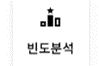|각 기준마다 빈도수가 많은 순위별 빈도 표기  -> 표기된 항목 중 빈도가 가장 높은 패턴만 표기|
|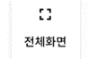|연관관계분석 화면을 전체화면으로 표기|
|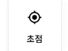|분석도의 초점을 현재화면 중심으로 재표기|
||분석한 연관관계 분석도를 위젯으로 저장|

### 4.6 기계학습

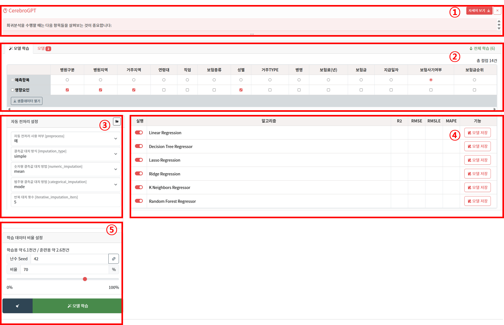

- 전처리 된 데이터로 알고리즘 유형에 따라 인공지능 모델을 학습하는 기능  

| 알고리즘 유형 | 설명 |
|---|---|
| 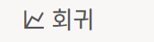| 연속적인 숫자 값을 예측하는 머신러닝 방식 |
| 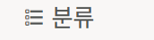 | 데이터를 특정 범주(클래스)로 구분하는 방식 |
| 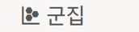 | 비슷한 데이터끼리 자동으로 묶는 비지도학습 방식 |
| 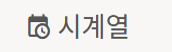 | 시간 흐름에 따른 패턴을 학습해 미래를 예측하는 방식 |
|  | 일반적인 패턴에서 벗어난 비정상 데이터를 찾아내는 방식 |

#### ① Cerebro GPT
- 알고리즘별로 GPT가 사용 전 알고리즘의 특성과 항목 선정에 대한 도움말을 안내하는 기능

#### ② 모델 학습
- 모델 학습을 위한 항목을 선택하는 기능
- 예측할 항목과 그에 따른 영향요인을 선택하여 항목 지정
   예) 보험사기여부에 관하여 병원구분, 병원지역, 거주지역, 성별이 영향을 준다고 가정하고 모델학습 수행 
- 샘플 데이터를 통해 예측항목과 영향요인을 판별하여 지정
- 학습 후 알고리즘별 모델 튜닝을 통한 재학습 기능 제공

#### ③ 자동 전처리 설정
- 학습 데이터 내 결측치를 자동으로 대처하도록 설정하는 기능 

| 전처리설정 | 설명 |
|---|---|
|결측값 대치 방식|simple(평균·중앙값·최빈값처럼 단순 통계값으로 결측값을 채우는 방식) Iterative(다른 변수들과의 관계를 학습하여 예측값으로 반복적으로 결측값을 채우는 방식)|
숫자형|drop(결측치가 있는 컬럼을 제거)  mean(평균값) median(중간값) mode(가장 많이 등장한 값(최빈값)) KNN(유사한 데이터(K-최근접이웃)을 찾아 주변값으로 결측치를 예측)|
|범주형|mode(가장 많이 등장한 값(최빈값)) drop(결측치가 있는 컬럼을 제거) str(문자열형태의 특정값으로 대체)|

#### ④ 학습 알고리즘 선정
- 모델 학습에 사용할 주요 알고리즘 선정
- 학습한 모델은 저장한 후 튜닝 가능

##### 1. 항목 내역

| 항목 | 설명 |
|---|---|
| 알고리즘 | 모델학습시 사용할 학습방식 (하단 알고리즘 참고) |
| R2 | 모델이 데이터를 얼마나 잘 설명하는지를 나타내는 적합도 지표 |
| RMSE | 예측값과 실제값의 차이를 제곱 평균 후 제곱근으로 계산한 오차 지표 |
| RMSLE | 실제값과 예측값의 로그 차이를 기반으로 계산하는 오차 지표 |
| MAPE | 실제값 대비 예측 오차의 평균 비율(%)을 나타내는 지표 |
| Accuracy | 전체 데이터 중 정확하게 분류된 비율 |
| AUC | ROC 곡선 아래 면적으로 모델의 분류 성능을 평가하는 지표 |
| Recall | 실제 양성 데이터 중 올바르게 예측한 비율 |
| Prec. | 양성으로 예측한 데이터 중 실제 양성의 비율 |
| F1 | Precision과 Recall의 조화 평균으로 계산한 성능 지표 |
| Kappa | 실제값과 예측값 간 일치도를 우연성을 제외하고 평가하는 지표 |
| MCC | 정분류와 오분류를 모두 고려한 이진 분류 성능 지표 |

##### 2. 알고리즘

| 구분 | 알고리즘 | 설명 |
|---|---|---|
| 회귀 | Linear Regression | 변수 간 선형 관계를 기반으로 연속형 값을 예측하는 회귀 알고리즘 |
| 회귀 | Decision Tree Regressor | 데이터 분할 규칙을 기반으로 값을 예측하는 트리 기반 회귀 알고리즘 |
| 회귀 | Lasso Regression | 불필요한 변수의 가중치를 제거하여 과적합을 방지하는 회귀 알고리즘 |
| 회귀 | Ridge Regression | 변수 가중치를 감소시켜 모델의 일반화 성능을 높이는 회귀 알고리즘 |
| 회귀 | K Neighbors Regressor | 주변의 유사한 데이터 값을 기반으로 결과를 예측하는 회귀 알고리즘 |
| 회귀 | Random Forest Regressor | 여러 개의 의사결정트리를 결합하여 예측 정확도를 높인 회귀 알고리즘 |
| 분류 | K Neighbors Classifier | 가까운 데이터의 다수 클래스를 기준으로 분류하는 알고리즘 |
| 분류 | Light Gradient Boosting Machine | 부스팅 기반으로 빠른 속도와 높은 성능을 제공하는 분류 알고리즘 |
| 분류 | Decision Tree Classifier | 데이터 조건 분기를 통해 클래스를 분류하는 트리 기반 알고리즘 |
| 분류 | CatBoost Classifier | 범주형 데이터 처리에 강점을 가진 부스팅 기반 분류 알고리즘 |
| 분류 | Random Forest Classifier | 여러 개의 트리를 결합하여 안정적으로 클래스를 분류하는 알고리즘 |
| 분류 | Extreme Gradient Boosting | 경사하강 기반 부스팅으로 높은 예측 성능을 제공하는 분류 알고리즘 |
| 분류 | Extra Trees Classifier | 무작위 분할을 활용하여 과적합을 줄인 트리 기반 분류 알고리즘 |
| 분류 | Logistic Regression | 확률 기반으로 데이터를 특정 클래스로 분류하는 알고리즘 |
| 분류 | Multi-layer Perceptron | 인공신경망 구조를 기반으로 학습하는 딥러닝 분류 알고리즘 |
| 분류 | Quadratic Discriminant Analysis | 클래스별 분포를 기반으로 데이터를 분류하는 통계 기반 알고리즘 |
| 군집 | K-means Clustering | 유사한 데이터끼리 K개의 군집으로 그룹화하는 군집 알고리즘 |
| 군집 | Density-Based Spatial Clustering | 밀도가 높은 영역을 기준으로 군집을 형성하는 알고리즘 |
| 시계열 | Naive Forecaster | 이전 시점 값을 그대로 사용하여 미래 값을 예측하는 시계열 알고리즘 |
| 시계열 | Seasonal Naive | 계절성을 기반으로 이전 패턴을 반복하여 예측하는 시계열 알고리즘 |
| 시계열 | Polynomial Trend | 다항식 추세를 기반으로 시계열 흐름을 예측하는 알고리즘 |
| 시계열 | Exponential Smoothing (ETS) | 추세와 계절성을 반영하여 데이터를 평활화하는 시계열 알고리즘 |
| 시계열 | Theta Forecaster | 장기 추세를 분해하여 예측 성능을 향상시키는 시계열 알고리즘 |
| 이상탐지 | K-Nearest Neighbors Detector | 주변 데이터와의 거리 차이를 기반으로 이상치를 탐지하는 알고리즘 |
| 이상탐지 | Isolation Forest | 데이터를 무작위로 분리하여 이상치를 탐지하는 트리 기반 알고리즘 |

#### ⑤ 학습 데이터 설정 

||||
|---|---|---|
|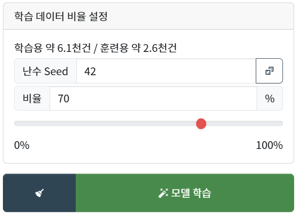|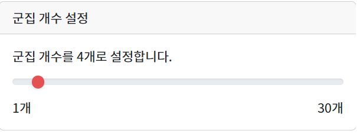|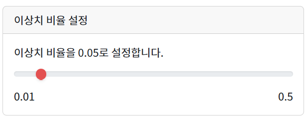|

- 모델 학습 전 학습비율, 이상치 등을 설정하고 모델 학습을 수행하는 기능

| 기능 | 설명 |
|---|---|
| 난수 | 데이터 분할 및 모델 학습 시 동일한 결과 재현을 위한 랜덤 시드 값 |
| 비율 | 학습 데이터와 검증 데이터로 분할할 비율 설정 |
| 군집 개수 | 데이터를 분류할 군집(Cluster)의 개수를 설정하는 값 |
| 이상치 비율 | 전체 데이터 중 이상치로 판단할 데이터의 비율 설정 |

#### 4.6.1 저장된 모델 확인

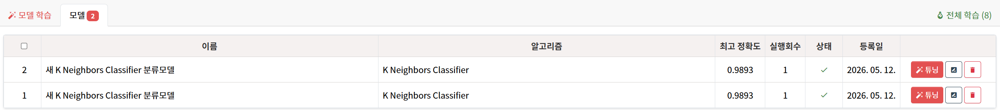

- 사용자가 학습한 후 저장한 모델의 정보를 확인하는 화면
- 저장된 모델을 바탕으로 성능 튜닝 및 오프라인 저장기능 제공

#### 4.6.2 모델 튜닝

|||
|---|---|
|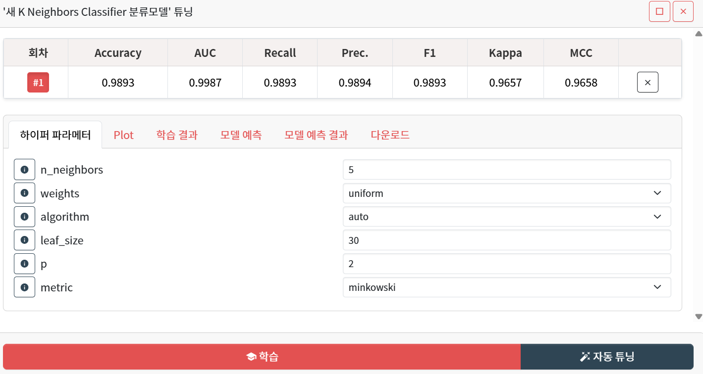|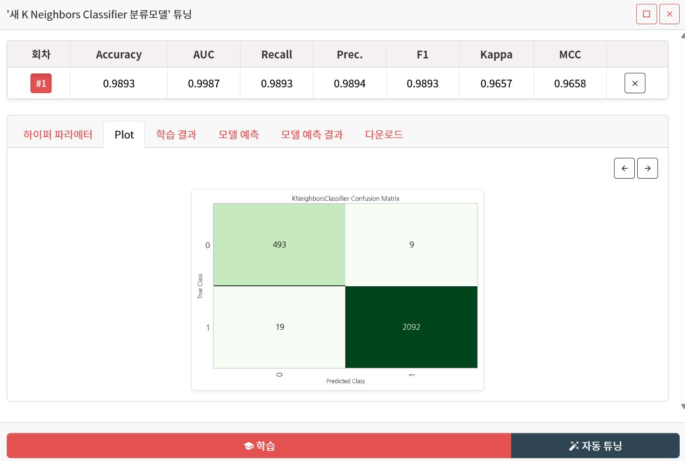
|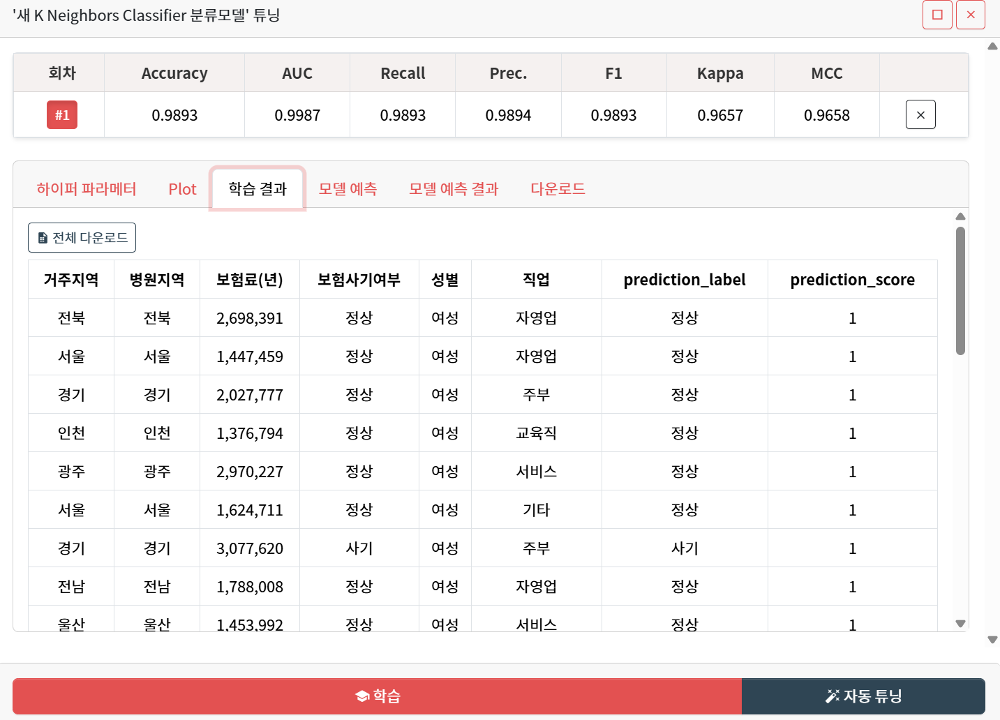|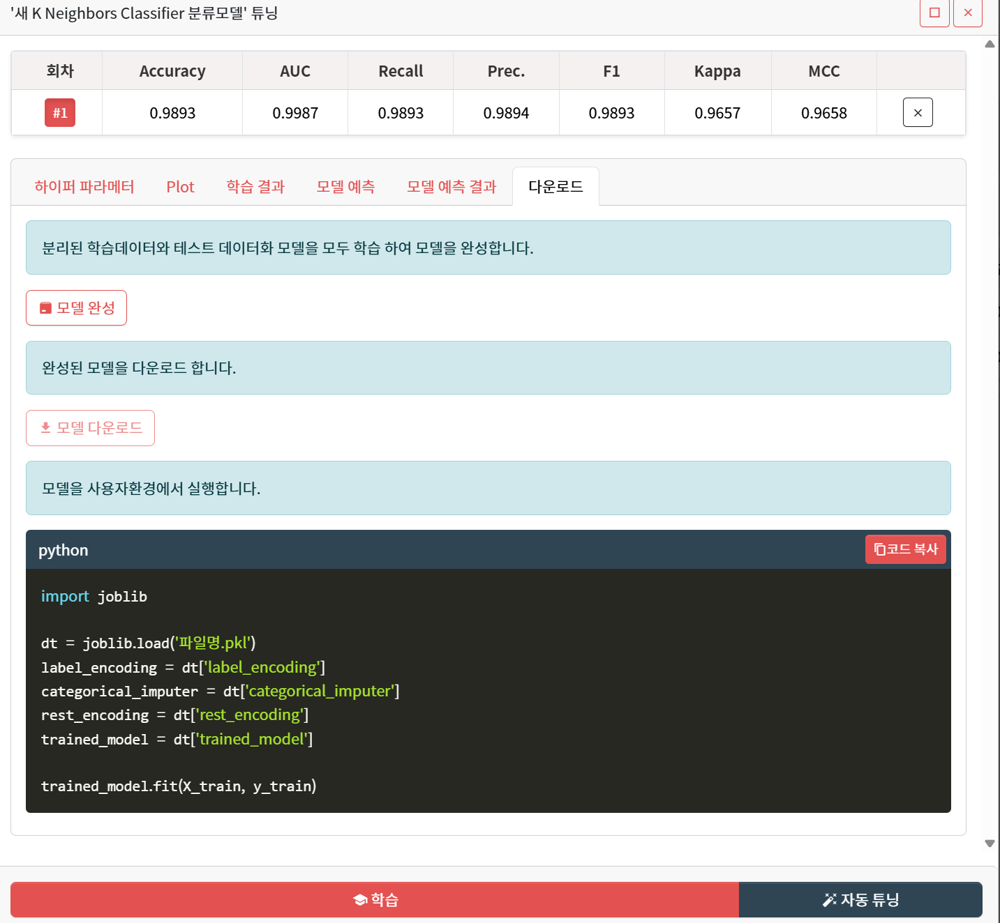|

- 저장된 모델에 대한 , 모델 예측, 학습결과, 다운로드하는 화면
- 파라메터를 재조정해 다시 학습을 수행 가능

|파라메터|설명|
|---|---|
|n_neighbors|분류 결정을 내리는 데 고려할 가장 가까운 이웃의 수|
|weights|가중치|
|algorithm|가장 가까운 이웃을 계산하는 데 사용할 알고리즘|
|leaf_size|BallTree 또는 KDTree 알고리즘을 사용할 때 전달할 리프 크기|
|p|Minkowski 거리 측정에 사용할 거리 지표|
|metric|거리 측정 방식 'minkowski': 거리를 계산할 때 사용되는 일반화된 형태. p 매개변수에 따라 다른 거리 측정 방식을 나타냄. 'manhattan': 격자 모양의 경로를 따라 계산하는 거리. 직선이 아닌 수평, 수직 이동만 고려. 'euclidean': 전통적인 직선 거리. 두 점 의 가장 짧은 직선 경로. 'chebyshev': 체스보드에서 킹이 이동할 수 있는 최소 이동 횟수로 거리를 측정.|

#### 4.6.3 모델 예측

|||
|---|---|
|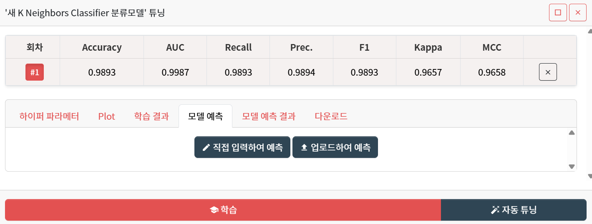|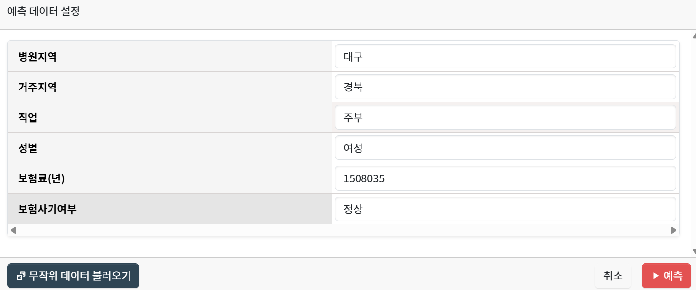

- 저장된 모델에 대한 샘플 데이터를 삽입하여 모델이 어떻게 예측하였는지 확인하는 화면
- 예측에 필요한 변수 정보를 입력하고 모델을 수행하여 수행결과를 비교

---

## 5. GPT

### 5.1 GPT 개요

<image src="./5_GPT/GPT 메인화면.png" >

- 사용자가 업로드한 자료를 기반으로 GPT를 활용한 데이터 분석 화면
- 데이터 변화 추이 및 전체 트렌드 분석 지원
- 최근 대화 이력을 아카이빙하여 보관
- 업로드한 자료에 대한 초기 분석 방향 제시
- 전체 대화 내 특정 키워드 검색 기능 제공

### 5.2 화면 구성

<image src="./5_GPT/GPT_화면구성.png" >

| 메뉴 | 설명 |
|---|---|
|<image src ="./5_GPT/GPT 새 대화.png">|신규 대화 생성|
|<image src ="./5_GPT/GPT 내 문서.png">|사용자가 업로드한 분석 자료 확인|
|<image src ="./5_GPT/GPT 파일 첨부.png">|새로 분석할 자료 업로드|
|<image src ="./5_GPT/GPT 데이터소스.png">|사용자가 업로드한 분석 자료 확인|
|<image src ="./5_GPT/GPT 보내기.png">|작성한 대화를 GPT로 수신|

### 5.3 내 문서

<image src="./5_GPT/GPT 내문서.png">

- 데이터 및 문서 분석을 위한 자료 관리 화면
- 자료별 공유 여부 및 문서 종류 확인 지원
- 자료사전을 통한 주요 분석 용어 정보 제공
- DBMS별 테이블 생성 및 조회 기능 지원

| 메뉴 | 설명 |
|---|---|
|<image src ="./5_GPT/내문서_검색.png">|내 문서 내 자료 검색|
|<image src ="./5_GPT/내문서_문서_분석데이터.png">|문서 구분별 자료 조회|
|<image src ="./5_GPT/내문서_업로드.png">|신규 분석 자료 업로드|
|<image src ="./5_GPT/내문서_문서포함검색.png">|선택한 문서를 포함하여 GPT 질의 수행|
|<image src ="./5_GPT/내문서_자료사전.png">|업무별 주요 용어 정보 제공(컬럼 ID, 컬럼명, 속성 등)|

### 5.4 자료 사전

<image src="./5_GPT/GPT_자료사전.png">
<image src="./5_GPT/GPT_자료사전2.png">

- 업무에서 사용하는 데이터 컬럼 정보를 사전 형태로 제공
- 업무 관련 테이블 조합 및 쿼리 작성 보조 기능 지원

---
## 6. Dashboard

### 6.1 Dashboard 개요
- 

### 6.2 화면 구성
- 

### 5.3 대시보드 생성
- 

### 5.4 위젯 추가
- 

### 5.5 대시보드 관리
- 

### 5.6 자동 생성 기능
- 

### 5.7 대시보드 활용
- 

---

## 6. Report

### 6.1 Report 개요
- Report 화면의 목적
- 분석 결과를 보고서로 정리하는 기능
- 보고서 생성 및 관리 기능

### 6.2 화면 구성
- 데이터 선택 영역
- 보고서 생성 버튼 영역
- 보고서 분류 탭
- 보고서 목록 테이블
- 보고서 관리 영역

### 6.3 보고서 생성 방식
- AI로 만들기
- 템플릿에서 만들기
- 빈 보고서 만들기

### 6.4 보고서 목록 관리
- 전체 보고서
- 내 보고서
- 공유받은 보고서
- 템플릿

### 6.5 보고서 정보 확인
- 번호
- 구분
- 제목
- 소유자
- 생성일
- 최근 수정일
- 관리 항목

### 6.6 보고서 편집
- 보고서 제목 설정
- 분석 내용 입력
- 차트 및 위젯 삽입
- 데이터 요약 내용 삽입

### 6.7 보고서 공유
- 보고서 공유 기능
- 공유받은 보고서 확인
- 협업 및 권한 관리

### 6.8 보고서 활용
- 분석 결과 문서화
- 내부 보고 자료 작성
- 데이터 기반 의사결정 자료 생성